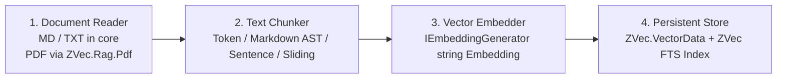
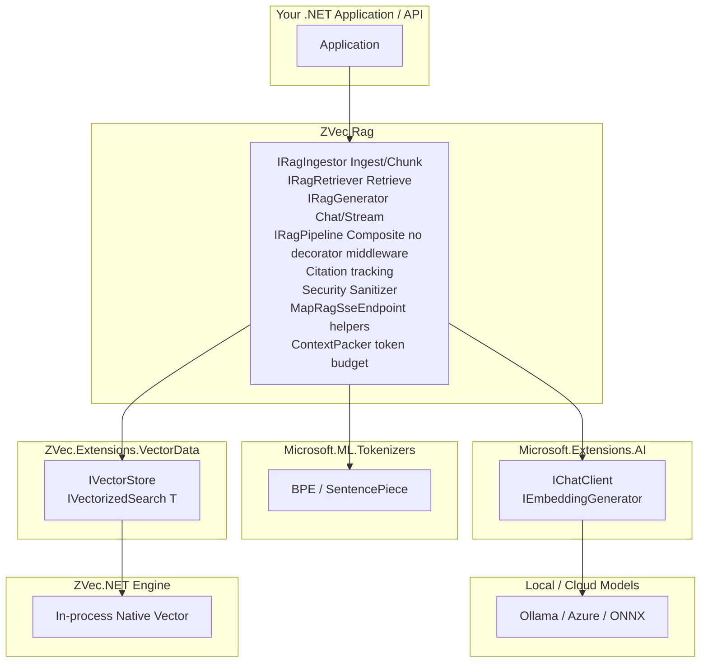

# ZVec.Rag 🚀

> **Local-first RAG for .NET. No cloud. No Python. No kidding.**

`ZVec.Rag` is a high-performance, embedded, local-first Retrieval-Augmented Generation (RAG) framework built on top of [ZVec.NET](https://github.com/ahmedSamir50/AdamSystems.ZVec.NET) and Microsoft's AI ecosystem primitives (`Microsoft.Extensions.VectorData` and `Microsoft.Extensions.AI`).

---

## ⚡ Key Features

- **No Cloud Required**: Runs 100% in-process on Windows, Linux, macOS, Android, and iOS. Zero monthly Azure/Qdrant vector DB bill.
- **`Microsoft.Extensions.VectorData` Connector**: First-class `IVectorStore` and `IVectorizedSearch<TRecord>` implementation backing ZVec.NET. Works seamlessly with Semantic Kernel, Microsoft Agent Framework, and community RAG tools.
- **`Microsoft.Extensions.AI` Ecosystem Integration**: Plug-and-play with any `IChatClient` or `IEmbeddingGenerator` (Ollama, Azure OpenAI, ONNX Runtime, LLamaSharp).
- **Streaming Citations (`IAsyncEnumerable<RagChunk>`)**: Real-time token streaming with precise document & page citation tracking (`SourceDoc`, `Page`, `Offset`, `Score`). SSE via `MapRagSseEndpoint` (links `RequestAborted` to cancel generation).
- **Universal Tokenization**: `Microsoft.ML.Tokenizers` engine (Tiktoken BPE `cl100k_base` default, `o200k_base` when embedder model indicates GPT-4o family). SentencePiece/WordPiece via `TokenizerModelPath` (`FileStream`, not embedded).
- **Transparent Document Ingestion**: Core `ZVec.Rag` ships text/markdown readers and ZVec-owned `IZVecTextChunker` ACL (`TokenTextChunker`, `MarkdownHeadingChunker`, `SentenceTextChunker`). PDF/HTML via optional `ZVec.Rag.Pdf` package. Bounded `System.Threading.Channels` pipeline (no `Task.Run`).
- **Embedded Hybrid Search**: In-database dense + FTS (full-text search) retrieval with native Reciprocal Rank Fusion (`ZVecRrfReranker`).
- **Native AOT & Trimmer Friendly**: `ZVec.Extensions.VectorData` connector is Native AOT-verified (`ZVec.AotTestApp`, Phase 0). Full `ZVec.Rag` pipeline AOT is a **Phase 2 gate** (`ZVec.Rag.AotTestApp`, Story 2.7) — do not claim end-to-end pipeline AOT until that story passes.
- **Project template (planned)**: `dotnet new rag` scaffolding ships in **Story 3.1** (`ZVec.Rag.Template`); use `samples/ZVec.Rag.Console` today.

---

## 📦 Packages in this Repository & Cross-Navigation

| Package | Version | Primary Focus & Responsibility | Synergy & Cross-Navigation ("If you need X...") |
|---|---|---|---|
| **`ZVec.Extensions.VectorData`** | `1.0.0-preview.1` | Official `Microsoft.Extensions.VectorData` connector for ZVec.NET | Core vector store (`IVectorStore`). *Need full RAG orchestration & citations? Add **`ZVec.Rag`**. Need zero-reflection AOT schemas? Add **`ZVec.Extensions.VectorData.SourceGenerator`**.* |
| **`ZVec.Rag`** | `0.5.0-preview.1` | Batteries-included RAG orchestration (`IRagIngestor`, `IRagRetriever`, `IRagGenerator`, `IRagPipeline`, citations, SSE) | *Need pure vector storage for Semantic Kernel / Agent Framework? Use **`ZVec.Extensions.VectorData`**. Need unit test fakes without LLMs? Add **`ZVec.Rag.Testing`**.* |
| **`ZVec.Rag.Testing`** | `0.5.0-preview.1` | Unit testing fakes shipped today: `DeterministicEmbedder`, `FakeChatClient` (`SemanticTestEmbedder` / `IRagEvaluator` planned in **Story 2.8**) | *Add to test projects to mock RAG pipelines without external LLMs.* |
| **`ZVec.Extensions.VectorData.SourceGenerator`** | `1.0.0-preview.1` | Roslyn source generator for zero-reflection AOT record mappers | *Referenced as analyzer from apps using annotated `[VectorStore]` POCOs.* |
| **`ZVec.Extensions.VectorData.Analyzers`** | `1.0.0-preview.1` | Roslyn analyzers (`ZVEC001`, `ZVEC002`) for VectorData connector hygiene | *Ships with the connector package graph.* |
| *Planned — Story 3.1* | — | `ZVec.Rag.Template` (`dotnet new rag`) | *Not in this repo yet.* |
| *Planned — Story 4.1* | — | `ZVec.Rag.LLamaSharp`, `ZVec.Rag.ONNX` recipe adapters | *Not in this repo yet.* |

---

## 💻 Honest Quickstart: Ingestion + Chat in 20 Lines

The quickstart demonstrates the **full RAG lifecycle**: Document Ingestion (`IngestTextAsync`) and Real-time SSE Streaming (`MapRagSseEndpoint`).

```csharp
using Microsoft.Extensions.AI;
using ZVec.Rag;
using ZVec.Rag.Streaming;
using ZVec.Rag.Testing; // DeterministicEmbedder + FakeChatClient for tests; swap for real IChatClient / IEmbeddingGenerator in production (Story 4.1 recipes).

var builder = WebApplication.CreateBuilder(args);

// Register ZVec RAG pipeline with Microsoft.Extensions.AI abstractions
builder.Services.AddZVecRag(opts => {
    opts.StoragePath = "./rag.zvec";
    opts.Embedder = new DeterministicEmbedder(); // replace with your IEmbeddingGenerator<string, Embedding<float>>
    opts.Chat = new FakeChatClient("Hello", " from ZVec.Rag"); // replace with your IChatClient (Ollama/Azure/ONNX — Story 4.1)
    opts.RrfK = 60; // Dense + FTS + RRF rerank (maps to ZVecHybridSearchOptions)
})
.AddTokenChunker(maxTokens: 512, overlapTokens: 64)
.AddMarkdownChunker();

var app = builder.Build();

// 1. Ingest Text / Markdown Document (auto-chunked by TokenTextChunker or MarkdownHeadingChunker)
app.MapPost("/ingest", async (string text, string docId, IRagIngestor ingestor) => {
    await ingestor.IngestTextAsync(text, documentId: docId);
    return Results.Ok($"Document {docId} ingested successfully.");
});

// 2. Real-time unbuffered SSE streaming chat (query string: ?question=...)
// Links HttpContext.RequestAborted to AskAsync so client disconnect cancels generation.
app.MapRagSseEndpoint("/chat");

app.Run();
```

---

## 📄 Transparent Document Ingestion Architecture

Ingestion in `ZVec.Rag` is divided into pluggable pipeline stages (ZVec-owned ACL; no `Microsoft.Extensions.DataIngestion` dependency):



- **Built-in Defaults**: Out-of-the-box `IngestTextAsync` handles plain text & markdown using token-boundary chunking (`TokenTextChunker`).
- **Advanced File Formats (PDF / HTML)**: Optional `ZVec.Rag.Pdf` package (`PdfDocumentReader`); not referenced by core `ZVec.Rag` or the AOT harness.
- **Explicit Chunking Strategies**: `AddTokenChunker` (512 tokens, 64 overlap default), `AddMarkdownChunker`, or `AddSentenceChunker` via DI. Override per ingest with `IngestOptions.Chunker` or `IngestOptions.OnDuplicate` (`Replace`, `Append`, `Skip`).

---

## 🔤 Tokenizer Strategy: `Microsoft.ML.Tokenizers`

- **Primary Tokenizer (`Microsoft.ML.Tokenizers`)**: Tiktoken BPE (`cl100k_base` default, `o200k_base` when embedder model id indicates GPT-4o family). Override via `ZVecRagOptions.TokenizerEncoding`.
- **SentencePiece/WordPiece**: Load vocab from `ZVecRagOptions.TokenizerModelPath` via `FileStream` (not `EmbeddedResource`).

---

## 🌐 Ecosystem Architecture

> **Status:** Security sanitizer shipped (Story 2.6). Pipeline AOT gate (Story 2.7) remains until Task 2.7.3 passes.


---

## 🛠️ Installation & Template Usage

```bash
# Clone and run the console sample today
dotnet run --project samples/ZVec.Rag.Console

# dotnet new rag template — planned Story 3.1 (ZVec.Rag.Template NuGet not shipped yet)
```

---

## 📜 License

This project is licensed under the [Apache-2.0 License](LICENSE).
