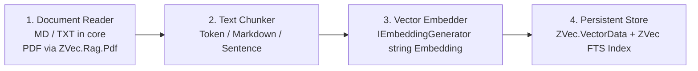
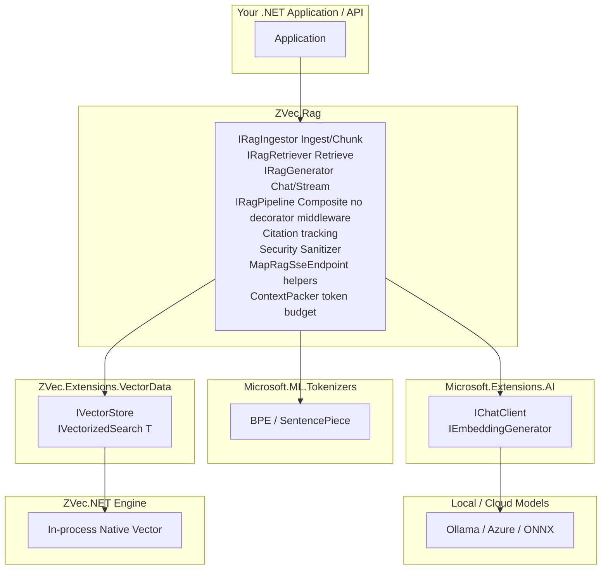

# ZVec.Rag 🚀

> **Local-first RAG for .NET. No cloud. No Python. No kidding.**

`ZVec.Rag` is a high-performance, embedded, local-first Retrieval-Augmented Generation (RAG) framework built on top of [ZVec.NET](https://github.com/ahmedSamir50/AdamSystems.ZVec.NET) and Microsoft's AI ecosystem primitives (`Microsoft.Extensions.VectorData` and `Microsoft.Extensions.AI`).

---

## ⚡ Key Features

- **No Cloud Required**: Runs 100% in-process on Windows, Linux, macOS, Android, and iOS. Zero monthly Azure/Qdrant vector DB bill.
- **`Microsoft.Extensions.VectorData` Connector**: First-class `IVectorStore` and `IVectorizedSearch<TRecord>` implementation backing ZVec.NET. Works seamlessly with Semantic Kernel, Microsoft Agent Framework, and community RAG tools.
- **`Microsoft.Extensions.AI` Ecosystem Integration**: Plug-and-play with any `IChatClient` or `IEmbeddingGenerator` (Ollama, Azure OpenAI, ONNX Runtime, LLamaSharp).
- **Streaming Citations (`IAsyncEnumerable<RagChunk>`)**: Real-time token streaming with precise document & page citation tracking (`SourceDoc`, `Page`, `Offset`, `Score`). SSE via `MapRagSseEndpoint` (links `RequestAborted` to cancel generation).
- **Universal Tokenization**: `Microsoft.ML.Tokenizers` engine (Tiktoken BPE `cl100k_base` default, `o200k_base` when embedder model indicates GPT-4o family). SentencePiece/WordPiece via `TokenizerModelPath` (`FileStream`, not embedded).
- **Transparent Document Ingestion**: Core `ZVec.Rag` ships text/markdown readers and ZVec-owned `IZVecTextChunker` ACL (`TokenTextChunker`, `MarkdownHeadingChunker`, `SentenceTextChunker`). PDF/HTML via optional `ZVec.Rag.Pdf` package. Bounded `System.Threading.Channels` pipeline (no `Task.Run`).
- **Embedded Hybrid Search**: In-database dense + FTS (full-text search) retrieval with native Reciprocal Rank Fusion (`ZVecRrfReranker`).
- **Native AOT & Trimmer Friendly**: `ZVec.Extensions.VectorData` connector is Native AOT-verified (`ZVec.AotTestApp`, Phase 0). Native AOT for the RAG pipeline is verified in CI by publishing and running `tests/ZVec.Rag.AotTestApp` (`rag-aot-smoke`) on linux-x64, win-x64, and osx-x64: text ingest, hybrid retrieve, `AskAsync`. PDF, SSE, and LLamaSharp are not in that smoke.
- **Project template (planned)**: `dotnet new zvec-rag` scaffolding ships in **Story 3.1** (`ZVec.Rag.Template`); use `samples/ZVec.Rag.Console` today.

---

## What this is / is not

**What v1 is:** a **local-first Naive RAG starter** — single-shot hybrid top-k retrieval, token-budget context packing, and one LLM generate call — aimed at **pointed questions** over **text and markdown** you ingest in-process. Hybrid dense+FTS+RRF and markdown heading metadata are real improvements **inside** the Naive retrieve-then-generate pattern ([Lewis et al., 2020](https://arxiv.org/abs/2005.11401); [Gao et al., 2023](https://arxiv.org/abs/2312.10997) Naive vs Advanced taxonomy).

**What v1 is not:**

- **Not** Advanced RAG over complex documents (layout-aware tables, figures, financial 10-K cell QA).
- **Not** a compare-two-filings, summarize-whole-topic, or multi-part research assistant.
- **Not** auto-retrieval with inferred metadata filters (year, doc, page) — `RetrieveAsync` embeds the raw question once; chat history is for generation only.

Chunking always extracts text from its surrounding context; token windows do not preserve table headers, units, or page coherence. `MarkdownHeadingChunker` is heading-**split** only — it does not stamp `HeadingPath` on child chunks today ([Liu, LlamaIndex workshop](https://www.youtube.com/watch?v=dI_TmTW9S4c&t=4778s); planned D-7 / Epic 8.7). Planned `ZVec.Rag.Pdf` (Sample 02) uses **text extract** (PdfPig-class); **table-cell QA is post-v1** ([financial chunking review](https://doi.org/10.1109/it67293.2026.11435730); [PDF parsing for financial QA](https://www.alphaxiv.org/abs/2604.12047)). Future work: Epic 8.7 (complex-document ingest) and 8.8 (query complexity) in the project plan.

We do **not** publish Recall@K or table-QA benchmarks in README marketing. Use `IRagEvaluator` / `DeterministicEvaluator` in tests; optional local SOTA runs stay gitignored.

---

## 📦 Packages in this Repository & Cross-Navigation

| Package | Version | Primary Focus & Responsibility | Synergy & Cross-Navigation ("If you need X...") |
|---|---|---|---|
| **`ZVec.Extensions.VectorData`** | `1.0.0-preview.1` | Official `Microsoft.Extensions.VectorData` connector for ZVec.NET | Core vector store (`IVectorStore`). *Need full RAG orchestration & citations? Add **`ZVec.Rag`**. Need zero-reflection AOT schemas? Add **`ZVec.Extensions.VectorData.SourceGenerator`**.* |
| **`ZVec.Rag`** | `0.5.0-preview.1` | Batteries-included RAG orchestration (`IRagIngestor`, `IRagRetriever`, `IRagGenerator`, `IRagPipeline`, citations, SSE) | *Need pure vector storage for Semantic Kernel / Agent Framework? Use **`ZVec.Extensions.VectorData`**. Need unit test fakes without LLMs? Add **`ZVec.Rag.Testing`**.* |
| **`ZVec.Rag.Testing`** | `0.5.0-preview.1` | Unit testing fakes: `DeterministicEmbedder`, `FakeChatClient`, `SemanticTestEmbedder`, `IRagEvaluator` / `DeterministicEvaluator`, optional LLM-judge evaluators (off in CI) | *Add to test projects to mock RAG pipelines without external LLMs.* |
| **`ZVec.Extensions.VectorData.SourceGenerator`** | `1.0.0-preview.1` | Roslyn source generator for zero-reflection AOT record mappers | *Referenced as analyzer from apps using annotated `[VectorStore]` POCOs.* |
| **`ZVec.Extensions.VectorData.Analyzers`** | `1.0.0-preview.1` | Roslyn analyzers (`ZVEC001`, `ZVEC002`) for VectorData connector hygiene | *Ships with the connector package graph.* |
| *Planned — Story 3.1* | — | `ZVec.Rag.Template` (`dotnet new zvec-rag`) | *Not in this repo yet.* |
| *Planned — Story 4.1* | — | `ZVec.Rag.LLamaSharp`, `ZVec.Rag.ONNX` recipe adapters | *Not in this repo yet.* |

---

## 💻 Honest Quickstart: Ingestion + Chat in 20 Lines

The quickstart demonstrates the **full RAG lifecycle**: Document Ingestion (`IngestTextAsync`) and Real-time SSE Streaming (`MapRagSseEndpoint`).

```csharp
using Microsoft.Extensions.AI;
using ZVec.Rag;
using ZVec.Rag.Streaming;
using ZVec.Rag.Testing; // DeterministicEmbedder + FakeChatClient for tests; swap for real IChatClient / IEmbeddingGenerator in production (Story 4.1 recipes).

var builder = WebApplication.CreateBuilder(args);

// Register ZVec RAG pipeline with Microsoft.Extensions.AI abstractions
builder.Services.AddZVecRag(opts => {
    opts.StoragePath = "./rag.zvec";
    opts.Embedder = new DeterministicEmbedder(); // replace with your IEmbeddingGenerator<string, Embedding<float>>
    opts.Chat = new FakeChatClient("Hello", " from ZVec.Rag"); // replace with your IChatClient (Ollama/Azure/ONNX — Story 4.1)
    opts.RrfK = 60; // Dense + FTS + RRF rerank (maps to ZVecHybridSearchOptions)
})
.AddTokenChunker(maxTokens: 512, overlapTokens: 64)
.AddMarkdownChunker();

var app = builder.Build();

// 1. Ingest Text / Markdown Document (auto-chunked by TokenTextChunker or MarkdownHeadingChunker)
app.MapPost("/ingest", async (string text, string docId, IRagIngestor ingestor) => {
    await ingestor.IngestTextAsync(text, documentId: docId);
    return Results.Ok($"Document {docId} ingested successfully.");
});

// 2. Real-time unbuffered SSE streaming chat (query string: ?question=...)
// Links HttpContext.RequestAborted to AskAsync so client disconnect cancels generation.
app.MapRagSseEndpoint("/chat");

app.Run();
```

---

## 📄 Transparent Document Ingestion Architecture

Ingestion in `ZVec.Rag` is divided into pluggable pipeline stages (ZVec-owned ACL; no `Microsoft.Extensions.DataIngestion` dependency):



- **Built-in Defaults**: Out-of-the-box `IngestTextAsync` handles plain text & markdown using token-boundary chunking (`TokenTextChunker`).
- **Advanced File Formats (PDF / HTML)**: Optional `ZVec.Rag.Pdf` package (`PdfDocumentReader`, PdfPig text extract — **not** layout-aware table QA; see Epic 8.7); not referenced by core `ZVec.Rag` or `ZVec.Rag.AotTestApp`.
- **Explicit Chunking Strategies**: `AddTokenChunker` (512 tokens, 64 overlap default), `AddMarkdownChunker` (heading-split per section — no `HeadingPath` metadata yet; see D-7), or `AddSentenceChunker` via DI. Override per ingest with `IngestOptions.Chunker` or `IngestOptions.OnDuplicate` (`Replace`, `Append`, `Skip`).
- **Ingest queue**: Bounded `System.Threading.Channels` (capacity 1024, backpressure on full) — not NATS or an external broker. `IngestTextAsync` awaits the in-process pipeline; distributed multi-producer ingest is post-v1 optional `IIngestBus`.

> **Re-ingest from scratch:** Ingestion is **not reversible**. If you change `GenerateSummaries`, embedding model, vector dimensions, quantize mode, or chunker settings, delete the index (`DuplicateMode.Replace`, new `StoragePath`, or remove storage) and **ingest again from the source**. There is no in-place vector rewrite.

### Optional section-summary helper (Story 2.9 — planned, default OFF)

When **`IngestOptions.GenerateSummaries`** is enabled, ingest builds a **second collection** (`rag_section_summaries`) with one LLM summary per **section** (~2k tokens by default), then chunks as today into **`rag_chunks`**. Children keep **`embed(Text)`** and reference the section via **`SectionSummaryId`**.

At query time (when on): **parallel hybrid** on both collections — union results and **boost** chunks whose parent summary also matched, so conceptual queries (e.g. topic Y not in any 512-token window) can still retrieve the right **child citations**. `ContextPacker` **prepends** the short section summary for generator context; citations stay the chunk `Text`.

This is an **accuracy helper** inside Naive RAG — **not** Advanced RAG, **not** RAPTOR. Default **OFF** (60s demo and `ZVec.Rag.AotTestApp` keep it off). One LLM call per section at ingest. Measure paired Lift@K with Story 2.8 before claiming public benchmarks.

| Helps | Does not fix |
|---|---|
| Conceptual retrieve when Y is in the section summary but not in a child window | PDF table-cell QA (D-7) |
| Exact serials/quotes (chunk `embed(Text)` + FTS still run) | Compare / summarize-all (D-8) |
| Generator context (“5V” + section title via prepended summary) | Changing product class to “Advanced RAG” |

**Recommend:** enable for internal docs with long sections and conceptual questions; keep default off for the demo and `ZVec.Rag.AotTestApp`.

---

## 🔤 Tokenizer Strategy: `Microsoft.ML.Tokenizers`

- **Primary Tokenizer (`Microsoft.ML.Tokenizers`)**: Tiktoken BPE (`cl100k_base` default, `o200k_base` when embedder model id indicates GPT-4o family). Override via `ZVecRagOptions.TokenizerEncoding`.
- **SentencePiece/WordPiece**: Load vocab from `ZVecRagOptions.TokenizerModelPath` via `FileStream` (not `EmbeddedResource`).

---

## 🌐 Ecosystem Architecture

> **Status:** Security sanitizer shipped (Story 2.6). Pipeline AOT verified (Story 2.7). `ZVec.Rag.Testing` ships `IRagEvaluator`, `DeterministicEvaluator`, `SemanticTestEmbedder` (Story 2.8).


---

## 🛠️ Installation & Template Usage

```bash
# Clone and run the console sample today
dotnet run --project samples/ZVec.Rag.Console

# dotnet new zvec-rag template — planned Story 3.1 (ZVec.Rag.Template NuGet not shipped yet)
# dotnet new install ZVec.Rag.Template && dotnet new zvec-rag -n MyApp
```

---

## 📜 License

This project is licensed under the [Apache-2.0 License](LICENSE).
