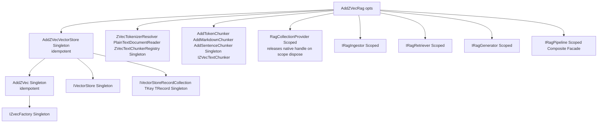

# Dependency Injection & Lifecycle Composition

This document details the Dependency Injection (DI) composition hierarchy, registration options, and lifetime contracts across `ZVec.NET`, `ZVec.Extensions.VectorData`, and `ZVec.Rag`.

---

## 🏗️ Composition Hierarchy

`AddZVecRag` serves as the top-level composition entry point. It configures and registers `ZVec.Extensions.VectorData` (`AddZVecVectorStore`) and `ZVec.NET` engine services (`AddZVec`) idempotently if they have not already been pre-registered.



### Chunker registration

```csharp
services.AddZVecRag(opts => { ... })
    .AddTokenChunker(maxTokens: 512, overlapTokens: 64)  // default chunker; strategy token-v1
    .AddMarkdownChunker()                                 // auto-selected for text/markdown when registered
    .AddSentenceChunker();
```

Chunker selection: `IngestOptions.Chunker` override → else `text/markdown` uses markdown chunker when registered → else token chunker. No `Activator.CreateInstance`.

### Optional recipe extensions (Story 4.1)

After `AddZVecRag`, hosts may register local model adapters:

```csharp
services.AddZVecRag(opts => { /* StoragePath, Embedder, Chat */ })
    .AddTokenChunker();

// Local GGUF (desktop/server; not AOT-safe)
services.AddZVecRagLLamaSharp(o => o.ModelPath = Environment.GetEnvironmentVariable("ZVEC_LLAMA_MODEL")!);

// ONNX embedder (768-d EmbeddingGemma for default pipeline; CLIP 512-d uses ZVecRagMultimodalRecordV1)
services.AddZVecRagOnnxEmbedder(o =>
{
    o.ModelPath = onnxPath;
    o.ModelKind = OnnxEmbeddingModelKind.EmbeddingGemma;
    o.Dimensions = ZVecRagRecordV1.DefaultDimensions;
});
```

`AddZVecRagLLamaSharp` registers **Singleton** chat + embed adapters and sets `ZVecRagOptions.Chat` / `Embedder` when those properties are still null. `AddZVecRagOnnxEmbedder` registers **Singleton** `OnnxEmbedder` and sets `Embedder` only when dimensions are 768 and `Embedder` is still null — it does **not** set `Chat`.

### OpenTelemetry host wiring (Story 4.2)

`ZVec.Rag` emits `ActivitySource` / `Meter` named `ZVec.Rag` from `ZVecRagTelemetry`. The host subscribes — no OTLP exporter ships in `ZVec.Rag`:

```csharp
builder.Services.AddOpenTelemetry()
    .WithTracing(t => t.AddSource("ZVec.Rag"))
    .WithMetrics(m => m.AddMeter("ZVec.Rag"))
    .AddOtlpExporter(); // host choice
```

---

## ⏱️ Service Lifetimes Matrix

| Service Interface | Concrete Implementation | DI Lifetime | Rationale & Lifecycle Contract |
|---|---|---|---|
| `IZvecFactory` | `ZVecFactory` | **Singleton** | Holds native C++ library handles (`SafeZvecHandle`). Must survive process lifetime. Shut down via `ApplicationStopping`. |
| `IVectorStore` | `ZVecVectorStore` | **Singleton** | Thread-safe entry point for collection management and listing. |
| `IVectorStoreRecordCollection<TKey, TRecord>` | `ZVecVectorizableRecordCollection` | **Singleton** | Holds collection file handle. Concurrent reads + optimize/reopen via shipped `OptimizeAndReopenAsync` (`lock (_initLock)`; native `MaxConcurrentReads` throttle). |
| `IRagIngestor` | `RagIngestor` | **Scoped** | Per-request/operation document ingestion state and bounded channel buffers. |
| `IRagRetriever` | `RagRetriever` | **Scoped** | Per-request query tokenization and candidate ranking. |
| `IRagGenerator` | `RagGenerator` | **Scoped** | Per-request LLM streaming state, context window budget manager, and HTTP client references. |
| `IRagPipeline` | `RagPipeline` | **Scoped** | Composite facade delegating to scoped sub-services. |
| `RagCollectionProvider` | `RagCollectionProvider` | **Scoped** | Single native collection handle per scope; `ReleaseNativeHandle` on dispose to avoid LOCK conflicts across scopes. |

---

## ⚙️ Configuration Options Hierarchy

```csharp
public sealed class ZVecRagOptions
{
    public string StoragePath { get; set; } = "./rag.zvec";

    // Microsoft.Extensions.AI Component Binding
    public IEmbeddingGenerator<string, Embedding<float>>? Embedder { get; set; }
    public IChatClient? Chat { get; set; }

    // Hybrid Retrieval & Tuning (maps to ZVecHybridSearchOptions<ZVecRagRecordV1>)
    public int RrfK { get; set; } = 60;
    public int MaxContextTokens { get; set; } = 4096;
    public int GenerationReserveTokens { get; set; } = 512;
    public ContextPackingStrategy ContextPacking { get; set; } = ContextPackingStrategy.ScoreDescending;

    // Tiktoken encoding override (default cl100k_base; o200k_base when embedder model indicates GPT-4o)
    public string? TokenizerEncoding { get; set; }

    // SentencePiece/WordPiece vocab path (FileStream load; not EmbeddedResource)
    public string? TokenizerModelPath { get; set; }

    // Nested VectorStore options (shipped ZVec.Extensions.VectorData.Store.ZVecVectorStoreOptions)
    public ZVecVectorStoreOptions VectorStore { get; set; } = new();

    // Application logging verbosity for RAG pipeline components (ILogger), not a native ZVec engine field
    public LogLevel LogLevel { get; set; } = LogLevel.Warning;
}
```

`ZVecVectorStoreOptions` (connector) exposes: `StoragePath`, `MaxConcurrentNativeCalls`, `EnableMmap`, `ReadOnly`, `MemoryLimitMb`, `ModelId`, `DefaultQuantizeType`. `AddZVecRag` copies `ZVecRagOptions.StoragePath` and `ModelId` into `VectorStore` when unset.

`AddZVecVectorStore` registers `IZvecFactory`, `ZVecVectorStore` (`ZVec.Extensions.VectorData.Store`), and `VectorStore` as singletons. It also registers `ZVecFactoryShutdownRegistration` (`IHostedService`) to call `IZvecFactory.Shutdown()` on `IHostApplicationLifetime.ApplicationStopping`. `ZVecVectorStoreOptions` maps to engine options: `MaxConcurrentNativeCalls` and `MemoryLimitMb` → `ZVecOptions`; `EnableMmap` and `ReadOnly` → `ZVecCollectionOptions` on `OpenOrCreate`; `DefaultQuantizeType` → HNSW index params via `ZVecVectorIndexResolver`; `ModelId` → embedder stamp sidecar via `ZVecIndexManifestManager`.

---

## 🔒 Process Teardown & iOS MonoAOT Finalizer Safety

Native C++ collection handles must be closed cleanly upon application shutdown to flush write-ahead logs (WAL) and prevent finalizer thread deadlocks during mobile process suspension.

`AddZVecVectorStore` registers `ZVecFactoryShutdownRegistration`, which hooks `IHostApplicationLifetime.ApplicationStopping` and calls `IZvecFactory.Shutdown()`:

```csharp
services.AddZVecVectorStore(); // registers shutdown on ApplicationStopping when hosted
```

Future `AddZVecRag` idempotently calls `AddZVecVectorStore`, so connector apps get the same teardown without duplicating the hook.

`AddZVecRag` registers scoped `IRagIngestor`, `IRagRetriever`, `IRagGenerator`, `IRagPipeline`, and `RagCollectionProvider` (single native collection handle per scope, released on scope dispose). Call `AddTokenChunker` (and optionally `AddMarkdownChunker` / `AddSentenceChunker`) after `AddZVecRag` to register chunkers.
