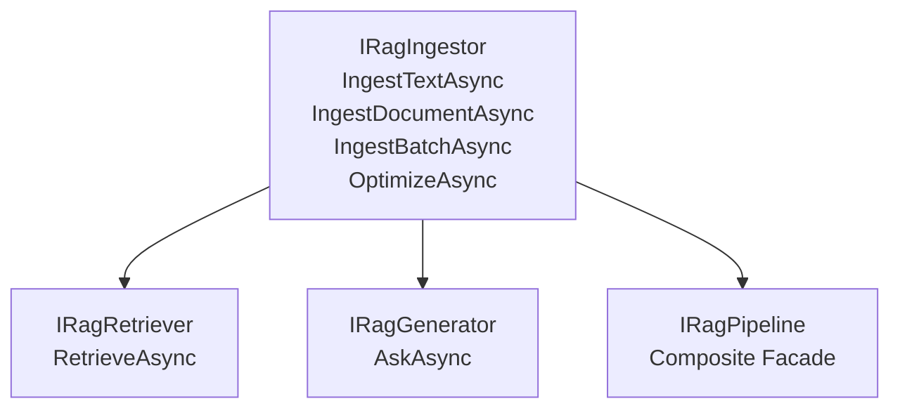

# RAG Pipeline Interface Segregation (ISP)

> **Status:** Stories 2.1–2.3 shipped — ISP facades, Channels ingestion ACL, `OptimizeAsync`, full `CitationOrder`, `MapRagSseEndpoint`. Story 2.6 (sanitizer) shipped. Story 2.7 (pipeline AOT) remains planned.

The `ZVec.Rag` framework enforces strict **Interface Segregation Principle (ISP)** compliance to eliminate God interfaces and allow application components to depend strictly on the capabilities they require.

---

## 🏗️ Interface Topology

Rather than bundling document ingestion, context retrieval, and LLM text generation into a single monolithic type, `ZVec.Rag` decomposes pipeline capabilities into three single-responsibility interfaces and one composite facade:



---

## 📜 Interface Definitions

### 1. `IRagIngestor` — Document Ingestion & Chunking
Responsible for reading documents, chunking text, generating vector embeddings, and writing records to the vector store.

```csharp
public interface IRagIngestor
{
    ValueTask<IngestionResult> IngestTextAsync(
        string text, 
        string documentId, 
        IngestOptions? options = null, 
        CancellationToken ct = default);

    ValueTask<IngestionResult> IngestDocumentAsync(
        Stream documentStream, 
        string documentId, 
        string contentType, 
        IngestOptions? options = null, 
        CancellationToken ct = default);

    ValueTask<IngestionResult> IngestBatchAsync(
        IEnumerable<IngestTextRequest> requests,
        IngestOptions? options = null,
        CancellationToken ct = default);

  Task OptimizeAsync(CancellationToken ct = default);
}
```

`IngestBatchAsync` auto-runs `OptimizeAsync` after the batch. `OptimizeAsync` delegates to `ZVecVectorizableRecordCollection.OptimizeAndReopenAsync` — no `ReaderWriterLockSlim`.

`IngestOptions` supports `OnDuplicate` (`Replace`, `Append`, `Skip`) and optional `Chunker` override. Chunkers register via `AddTokenChunker` / `AddMarkdownChunker` / `AddSentenceChunker`.

### 2. `IRagRetriever` — Hybrid Vector & FTS Search
Responsible for querying the vector store using dense vector similarity, full-text search (FTS), and native Reciprocal Rank Fusion (RRF).

```csharp
public interface IRagRetriever
{
    Task<IReadOnlyList<Citation>> RetrieveAsync(
        string query, 
        HybridSearchOptions? options = null, 
        CancellationToken ct = default);
}
```

### 3. `IRagGenerator` — LLM Generation & Token Streaming
Responsible for retrieving context, assembling prompt windows, querying `IChatClient`, and streaming SSE tokens with citations. ASP.NET apps can use `MapRagSseEndpoint` which links `HttpContext.RequestAborted` into `AskAsync`.

```csharp
public interface IRagGenerator
{
    IAsyncEnumerable<RagChunk> AskAsync(
        string question, 
        IList<ChatMessage>? history = null, 
        bool streamCitations = true, 
        CancellationToken ct = default);
}
```

### 4. `IRagPipeline` — Composite Facade (No Decorator Middleware)

Implements `IRagIngestor`, `IRagRetriever`, and `IRagGenerator` for single-service injection convenience in small applications. **Do not** wrap with `*RagDecorator` middleware — token packing, citations, and sanitization are composed via separate interfaces injected into `IRagGenerator`.

```csharp
public interface IRagPipeline : IRagIngestor, IRagRetriever, IRagGenerator
{
}
```

> **Rejected v1 pattern:** `TokenBudgetingRagDecorator`, `CitationTrackingRagDecorator`, or similar middleware stacks. They fight the 20-line `AddZVecRag` DX and the ISP design below.

---

## 🎯 Dependency Injection Best Practices

Inject only the specific interface required by each component:

```csharp
// Background worker service — needs ONLY ingestion capability
public sealed class DocumentIngestionWorker(IRagIngestor ingestor) : BackgroundService
{
    protected override async Task ExecuteAsync(CancellationToken ct)
    {
        await ingestor.IngestTextAsync("Policy text...", "policy-01", ct: ct);
    }
}

// Search API controller — needs ONLY retrieval capability
[ApiController]
[Route("api/search")]
public sealed class SearchController(IRagRetriever retriever) : ControllerBase
{
    [HttpGet]
    public async Task<IActionResult> Search([FromQuery] string q, CancellationToken ct) =>
        Ok(await retriever.RetrieveAsync(q, ct: ct));
}
```
