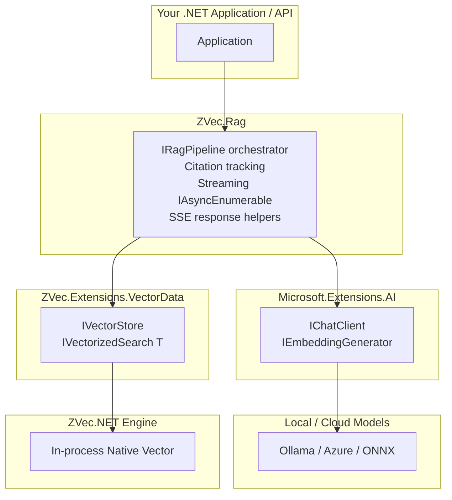

# System Architecture Overview

`ZVec.NET-RAG` is structured around two main layers:

1. **`ZVec.Extensions.VectorData`**: The `Microsoft.Extensions.VectorData` connector that bridges ZVec.NET's native embedded vector DB engine with the .NET AI ecosystem.
2. **`ZVec.Rag`**: The application integration starter wiring document ingestion, embedding generators, retrieval, citation tracking, and streaming generation.

