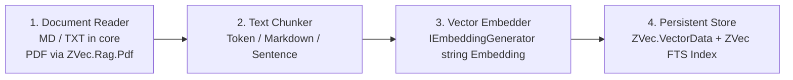

# RAG Pipeline & Document Ingestion Architecture

`ZVec.Rag` provides a batteries-included RAG orchestration layer (`IRagPipeline`, `IRagIngestor`, `IRagRetriever`, `IRagGenerator`) built on top of Microsoft AI ecosystem primitives:

> **Status:** Stories 2.1–2.3, 2.4.3 (Verify snapshots), 2.6, 2.7 (pipeline AOT), 2.8 (`IRagEvaluator`), and **2.9** (optional section-summary helper, default OFF) shipped. **Architecture class:** v1 pipeline is Naive RAG (single-shot hybrid retrieve + pack + one generate) per [Liu axes](https://www.youtube.com/watch?v=dI_TmTW9S4c&t=4778s); complex-document ingest (D-7 / Epic 8.7), query routing (D-8 / Epic 8.8), and production RAG ops (D-10 / Epic 8.9) are post-v1.

---

## 1. Document Ingestion Pipeline Architecture (`IRagIngestor`)

Ingestion is transparently divided into four distinct, pluggable stages (ZVec-owned ACL; no `Microsoft.Extensions.DataIngestion` dependency in core):

1. **Document Readers (`IRagDocumentReader`)** — format parsing ACL:
   - `PlainTextDocumentReader` (Default in core `ZVec.Rag`): Fast UTF-8 stream reader for plain text and Markdown.
   - `PdfDocumentReader`: Optional `ZVec.Rag.Pdf` package — **not** referenced by core or `ZVec.Rag.AotTestApp`.
   - `HtmlDocumentReader`: Optional future package for DOM stripping.
2. **Text Chunkers (`IZVecTextChunker`)** — separate from readers:
   - `TokenTextChunker` (Default): Splits text on token boundaries using `Microsoft.ML.Tokenizers` (512 tokens, 64-token overlap — sliding window is **inside** this chunker, not a separate strategy).
   - `MarkdownHeadingChunker`: **Heading-split** chunker — splits on `#` / `##` lines, then runs `TokenTextChunker` per section. It does **not** attach heading text as metadata on child chunks today; long sections can drop the title on later token windows. **Planned (D-7 / Epic 8.7):** `HeadingPath` and `ParentChunkId` on `ZVecRagRecordV1` so chunks stay coherent with their parent heading/page/table node.
   - `SentenceTextChunker`: Splits on sentence boundaries to avoid mid-sentence cuts.
3. **Deterministic Chunk ID Generator**:
   - Chunk IDs are generated using content-addressable SHA256 hashes: `ChunkId = SHA256(doc_uri | strategy_id | chunk_index)`. This ensures stability across re-ingestion and native content-based deduplication.
4. **Bounded Channel Dataflow Graph**:
   - Ingestion executes over bounded `System.Threading.Channels`: Document Parsing (Capacity 1024) $\rightarrow$ Deduplication (Capacity 2048) $\rightarrow$ Batch Embedding (Batch size 32) $\rightarrow$ Batch Vector Insertion (Batch size 100). `IngestionCheckpoint` deferred post-v1.
   - **Async contract:** `IZVecTextChunker` `IEnumerable<TextChunk>` is pushed into the bounded channel writer on the **caller continuation** — never `Task.Run`. Use `ConfigureAwait(false)` on every await. `EnsureCollectionExistsAsync` ForceYields then opens native on that worker; the first channel await is the consumer `WaitToReadAsync` on an empty channel; producer `WriteAsync` yields only when the channel is full (capacity 1024). ASP.NET Core has no request `SynchronizationContext`. Native upsert/query occupy that worker for the P/Invoke duration.
   - **In-process queue (not NATS):** `IngestionChannelPump` + `RagIngestor` already use bounded `System.Threading.Channels` (parse capacity 1024, wait-on-full backpressure). `IngestTextAsync` awaits pipeline completion so demos and `ZVec.Rag.AotTestApp` get deterministic results — that is **same-call, in-process** queuing, not direct synchronous embed. NATS/Rabbit/Azure Service Bus would be a **post-v1** optional `IIngestBus` for distributed multi-producer ETL; it is **not** core `ZVec.Rag` (extra daemon, serialize/deserialize overhead, not in AOT graph, CI cannot assume a broker).

### 1.1 Parent / heading coherence (D-7 — planned, not shipped)

Sliding 64-token overlap inside `TokenTextChunker` is a boundary patch, not structural coherence. Today `TextChunk` is `(Text, Offset)` only; `ZVecRagRecordV1` has no `HeadingPath` or `ParentChunkId`; `Citation` cannot show “this slice belongs to H2 Revenue.” `MarkdownHeadingChunker` splits on `^#{1,6}` then token-splits — it does **not** copy the heading onto later windows.

**Planned additive schema (Epic 8.7 / D-7 — do not change `ChunkId = SHA256(doc_uri | strategy_id | chunk_index)`):**

| Field | Type | Purpose |
|---|---|---|
| `HeadingPath` | indexed string | Breadcrumb from parse tree (e.g. `H1/H2 Revenue`) |
| `ParentChunkId` | indexed string, nullable | Heading/page/table node chunk id; empty for roots |

**Sequence:** layout-aware reader emits tree → stamp chunks → embed → (later) `ContextPacker` may fetch parent text by `ParentChunkId` ([Liu index≠synthesis](https://www.youtube.com/watch?v=dI_TmTW9S4c&t=4778s)). Org formats (PDF tables, PPT slides, DOCX styles, Excel sheets) need readers **before** stamps mean anything — PdfPig text flatten alone cannot invent parents.

### 1.2 Optional section-summary helper (Story 2.9 — shipped, default OFF)

Optional `IngestOptions.GenerateSummaries` (default **false**) improves **retrieve and pack accuracy** — not a new RAG product class (still Naive one-shot generate; **not** Advanced RAG, **not** RAPTOR).

**Ingest (when on):** split source into **sections** (default `SummarySectionMaxTokens` = 2048) → `IChatClient` summary per section (default `MaxSummaryTokens` = 128, one LLM call per section) → upsert `ZVecRagSectionSummaryV1` into collection **`rag_section_summaries`** (`embed(Summary)`) (or `ZVecRagOptions.SummaryCollectionName` / `{CollectionName}_summaries` when `CollectionName` is not `rag_chunks`); chunk the section → upsert children into **`rag_chunks`** with **`embed(Text)` unchanged** and indexed **`SectionSummaryId`** FK. `ChunkId` formula unchanged.

**Retrieve (when on):** **parallel hybrid** on both collections — union + **parent boost** (keep direct chunk hits; boost chunks whose parent summary also matched; add children of top matching summaries). **Pack:** prepend the short section summary so the generator is not blind (e.g. “5V” + “X1000” context); **cite** child `ChunkId` / `Text` only.

**When off / AOT:** single-collection chunk retrieve as today (`ZVec.Rag.AotTestApp` keeps `GenerateSummaries = false`).

**Re-ingest from scratch** if you flip summaries on/off, change embedder model/dimensions/quantize, or change chunker settings — ingestion is not an in-place edit (see README).

**Prompt:** section aboutness entailed by the source; preserve verbatim IDs/numbers/names/dates/URLs/table cells; `IRagSecuritySanitizer` on source and stored summary.

**Eval:** Story 2.8 `RecallAtKLift` on child `ChunkId`s; Story 2.9 contract test (summary path retrieves children when query token is only in summary); optional local real Lift@K — not README marketing.

**Separate from D-7:** extractive `HeadingPath` / `ParentChunkId` (layout parse tree) stays Epic 8.7 post-v1.

---

## 2. Context Packing, Tokenizer & RAG Evaluation Framework

- **ContextPacker (Story 2.1.3)**: `IRagGenerator` uses `ContextPacker` to enforce `MaxContextTokens`, reserve `GenerationReserveTokens` for the LLM reply, account for chat-template overhead, and optionally apply Lost-in-the-Middle reordering. Token budgeting is **inside** the generator — not a decorator middleware pipeline.
- **Prompt order ≠ citation list order:** `ContextPackingStrategy.LostInTheMiddle` permutes only the `<retrieved_context>` block sent to the LLM. `RagChunk.Citations` is always sorted by `CitationOrder` (`ScoreDescending` default) and keyed by `ChunkId` / `RankScore` — independent of prompt string order. LLM citation markers (if used) reference `ChunkId`, not 1-based prompt positions.
- **Primary Tokenizer Engine (`Microsoft.ML.Tokenizers`)**: Tiktoken BPE (`cl100k_base`, `o200k_base`) is in-box and AOT-safe. SentencePiece/WordPiece vocab files load via `FileStream` from shipped Content (not `EmbeddedResource`) unless trim-tested.
- **RAG Evaluation Module (`IRagEvaluator`, Story 2.8 — shipped)** in `ZVec.Rag.Testing`:
  - **Retrieval (CI-cheap, no LLM):** Recall@K, MRR, nDCG via `DeterministicEvaluator` / `SemanticTestEmbedder`; `RecallAtKLift` for paired on/off summary-helper comparisons (Story 2.9).
  - **Generation (optional):** Faithfulness, Answer Relevance, Context Precision via LLM-as-Judge (`IChatClient`) — off by default in CI.

---

## 3. Anti-Corruption Layer (ACL), Migration & Security

1. **Ingestion Anti-Corruption Layer**: Split into `IRagDocumentReader` (format parsing) and `IZVecTextChunker` (chunking via `Microsoft.ML.Tokenizers`). Core `ZVec.Rag` ships text/md only; PDF via optional `ZVec.Rag.Pdf`. SSE helpers (`MapRagSseEndpoint`) require `FrameworkReference` `Microsoft.AspNetCore.App` on `ZVec.Rag` (isolated in `Streaming/` with trim annotations; Story 2.7 console AOT does not claim SSE).
2. **Embedder Stamp Manifest (`zvec_index_manifest.json`)**: On index creation, `ZVecIndexManifestManager` writes a manifest recording `ModelId`, `Dimensions`, `QuantizeType`, embedding storage dtype, and timestamp. Writes use atomic `*.tmp` + `File.Replace`. Startup validation throws `ZVecEmbedderMismatchException` on model/quantize mismatch; `ZVecManifestException` (`Missing` / `Corrupt`) when the collection exists but the manifest does not. `ZVec.Rag` init (Task 2.1.4) wraps mismatch as `ZVecRagInitializationException` with remediation: delete storage, use a new `StoragePath`, or run `IRagMigrationManager`.
3. **Embedding Migration Manager (`IRagMigrationManager`)**: Automates background re-indexing when embedding models or dimensions change, performing shadow collection builds and atomic index swaps.
4. **Security Threat Model & Prompt Isolation (`IRagSecuritySanitizer`, Story 2.6)**: Retrieved chunks are sanitized at retrieve/pack time (delimiter/chunk-marker escape). `RagGenerator` places trusted policy in `ChatRole.System` only; `<retrieved_context>` lives in a separate `ChatRole.User` message. Does not eliminate all prompt injection — see `security-threat-model.md`.

---

## 4. Retrieval, Re-Ranking & Citation Generation

- **Hybrid Search & Fusion**: Native ZVec dense vector search + FTS keyword matching fused via Reciprocal Rank Fusion (`ZVecRrfReranker`, default $k=60$).
- **Re-Ranking Engines (`LlmReranker` / `ICrossEncoderReranker`)**: Pluggable re-ranking hook (deferred D-2, post-v1.1) enabling `LlmReranker` (via `IChatClient` prompt) and ONNX cross-encoders (`bge-reranker-v2-m3`). Default hybrid fusion remains `ZVecRrfReranker`.
- **Citation Tracking**: Round-trip metadata (`SourceDoc`, `SourceUri`, `SourceHash`, `Page`, `Offset`, `ChunkIndex`, `ChunkId`) into streaming `RagChunk` records, with distinct `RankScore`, `DenseScore`, and `FtsScore`. UI citation lists use `CitationOrder`; prompt packing uses `ContextPacker` strategy — these are decoupled.
- **SSE Response Helpers**: Real-time unbuffered Server-Sent Events endpoint helpers (`app.MapRagSseEndpoint(...)`) calling `Response.BodyWriter.FlushAsync()` after every chunk. **Must** pass `HttpContext.RequestAborted` as the `CancellationToken` to `IRagGenerator.AskAsync(...)` so client disconnect cancels LLM token generation.

---

## 5. Production RAG ops — library vs host (D-10 / Epic 8.9 — planned, not shipped)

v1 `ZVec.Rag` does **not** ship production alerting, cascading retrieve fallbacks, circuit-breaker / half-open health probes, or query / embedding / vector-search / LLM response caches. Those are **post-v1 Epic 8.9 / D-10** and belong in the **host application** (`Microsoft.Extensions.AI` caching decorators, `Microsoft.Extensions.Http.Resilience` / Polly, Aspire/Grafana alert rules).

| Concern | v1 `ZVec.Rag` | Host / later epic |
|---|---|---|
| Retrieve path | Hybrid dense + FTS + RRF (`RagRetriever`) — **primary**, not a degraded fallback | Optional extractive-only via `RetrieveAsync` without `AskAsync` |
| Retrieval quality | Offline `IRagEvaluator` (Story 2.8) — not live production gauges | Host dashboards if needed |
| Stage latency / tokens | Shipped `ZVecRagTelemetry` (`ActivitySource`, `zvec.rag.tokens`, `zvec.rag.stage.duration`) — host OTLP export | Host alert thresholds |
| Cascading fallbacks | Not shipped — typed exceptions; SSE cancel on disconnect | Host middleware / Polly |
| Query / embed / LLM caches | Not shipped | Host `IDistributedCache` / `HybridCache` or M.E.AI decorators |

Do not add `IRagFallbackPipeline` or in-library cache types without amending the plan and re-running spec_lock.

