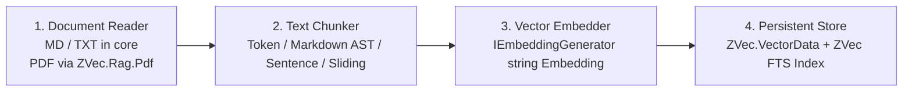

# RAG Pipeline & Document Ingestion Architecture

`ZVec.Rag` provides a batteries-included RAG orchestration layer (`IRagPipeline`, `IRagIngestor`, `IRagRetriever`, `IRagGenerator`) built on top of Microsoft AI ecosystem primitives:

> **Status:** Stories 2.1–2.3 and 2.6 shipped (Channels ACL, `OptimizeAsync`, `CitationOrder`, `MapRagSseEndpoint`, `IRagSecuritySanitizer`). Stories 2.4.3–2.8 (Verify snapshots, evaluation, pipeline AOT gate closure) remain planned.

---

## 1. Document Ingestion Pipeline Architecture (`IRagIngestor`)

Ingestion is transparently divided into four distinct, pluggable stages (ZVec-owned ACL; no `Microsoft.Extensions.DataIngestion` dependency in core):

1. **Document Readers (`IRagDocumentReader`)** — format parsing ACL:
   - `PlainTextDocumentReader` (Default in core `ZVec.Rag`): Fast UTF-8 stream reader for plain text and Markdown.
   - `PdfDocumentReader`: Optional `ZVec.Rag.Pdf` package — **not** referenced by core or the AOT harness.
   - `HtmlDocumentReader`: Optional future package for DOM stripping.
2. **Text Chunkers (`IZVecTextChunker`)** — separate from readers:
   - `TokenTextChunker` (Default): Splits text strictly on token boundaries using `Microsoft.ML.Tokenizers` (e.g. 512 tokens with 64-token overlap).
   - `MarkdownHeadingChunker`: AST-aware chunker preserving section titles (`# H1`, `## H2`) attached as metadata to child paragraphs.
   - `SentenceTextChunker`: Prevents splitting mid-sentence for high-precision semantic search.
3. **Deterministic Chunk ID Generator**:
   - Chunk IDs are generated using content-addressable SHA256 hashes: `ChunkId = SHA256(doc_uri | strategy_id | chunk_index)`. This ensures stability across re-ingestion and native content-based deduplication.
4. **Bounded Channel Dataflow Graph**:
   - Ingestion executes over bounded `System.Threading.Channels`: Document Parsing (Capacity 1024) $\rightarrow$ Deduplication (Capacity 2048) $\rightarrow$ Batch Embedding (Batch size 32) $\rightarrow$ Batch Vector Insertion (Batch size 100). `IngestionCheckpoint` deferred post-v1.
   - **Async contract:** `IZVecTextChunker` `IEnumerable<TextChunk>` is pushed into the bounded channel writer on the **caller continuation** — never `Task.Run`. Use `ConfigureAwait(false)` on every await. `EnsureCollectionExistsAsync` ForceYields then opens native on that worker; the first channel await is the consumer `WaitToReadAsync` on an empty channel; producer `WriteAsync` yields only when the channel is full (capacity 1024). ASP.NET Core has no request `SynchronizationContext`. Native upsert/query occupy that worker for the P/Invoke duration.

---

## 2. Context Packing, Tokenizer & RAG Evaluation Framework

- **ContextPacker (Story 2.1.3)**: `IRagGenerator` uses `ContextPacker` to enforce `MaxContextTokens`, reserve `GenerationReserveTokens` for the LLM reply, account for chat-template overhead, and optionally apply Lost-in-the-Middle reordering. Token budgeting is **inside** the generator — not a decorator middleware pipeline.
- **Prompt order ≠ citation list order:** `ContextPackingStrategy.LostInTheMiddle` permutes only the `<retrieved_context>` block sent to the LLM. `RagChunk.Citations` is always sorted by `CitationOrder` (`ScoreDescending` default) and keyed by `ChunkId` / `RankScore` — independent of prompt string order. LLM citation markers (if used) reference `ChunkId`, not 1-based prompt positions.
- **Primary Tokenizer Engine (`Microsoft.ML.Tokenizers`)**: Tiktoken BPE (`cl100k_base`, `o200k_base`) is in-box and AOT-safe. SentencePiece/WordPiece vocab files load via `FileStream` from shipped Content (not `EmbeddedResource`) unless trim-tested.
- **RAG Evaluation Module (`IRagEvaluator`, Story 2.8)** in `ZVec.Rag.Testing`:
  - **Retrieval (CI-cheap, no LLM):** Recall@K, MRR, nDCG via `DeterministicEvaluator` / `SemanticTestEmbedder`.
  - **Generation (optional):** Faithfulness, Answer Relevance, Context Precision via LLM-as-Judge (`IChatClient`) — off by default in CI.

---

## 3. Anti-Corruption Layer (ACL), Migration & Security

1. **Ingestion Anti-Corruption Layer**: Split into `IRagDocumentReader` (format parsing) and `IZVecTextChunker` (chunking via `Microsoft.ML.Tokenizers`). Core `ZVec.Rag` ships text/md only; PDF via optional `ZVec.Rag.Pdf`. SSE helpers (`MapRagSseEndpoint`) require `FrameworkReference` `Microsoft.AspNetCore.App` on `ZVec.Rag` (isolated in `Streaming/` with trim annotations; Story 2.7 console AOT does not claim SSE).
2. **Embedder Stamp Manifest (`zvec_index_manifest.json`)**: On index creation, `ZVecIndexManifestManager` writes a manifest recording `ModelId`, `Dimensions`, `QuantizeType`, embedding storage dtype, and timestamp. Writes use atomic `*.tmp` + `File.Replace`. Startup validation throws `ZVecEmbedderMismatchException` on model/quantize mismatch; `ZVecManifestException` (`Missing` / `Corrupt`) when the collection exists but the manifest does not. `ZVec.Rag` init (Task 2.1.4) wraps mismatch as `ZVecRagInitializationException` with remediation: delete storage, use a new `StoragePath`, or run `IRagMigrationManager`.
3. **Embedding Migration Manager (`IRagMigrationManager`)**: Automates background re-indexing when embedding models or dimensions change, performing shadow collection builds and atomic index swaps.
4. **Security Threat Model & Prompt Isolation (`IRagSecuritySanitizer`, Story 2.6)**: Retrieved chunks are sanitized at retrieve/pack time (delimiter/chunk-marker escape). `RagGenerator` places trusted policy in `ChatRole.System` only; `<retrieved_context>` lives in a separate `ChatRole.User` message. Does not eliminate all prompt injection — see `security-threat-model.md`.

---

## 4. Retrieval, Re-Ranking & Citation Generation

- **Hybrid Search & Fusion**: Native ZVec dense vector search + FTS keyword matching fused via Reciprocal Rank Fusion (`ZVecRrfReranker`, default $k=60$).
- **Re-Ranking Engines (`LlmReranker` / `ICrossEncoderReranker`)**: Pluggable re-ranking hook (deferred D-2, post-v1.1) enabling `LlmReranker` (via `IChatClient` prompt) and ONNX cross-encoders (`bge-reranker-v2-m3`). Default hybrid fusion remains `ZVecRrfReranker`.
- **Citation Tracking**: Round-trip metadata (`SourceDoc`, `SourceUri`, `SourceHash`, `Page`, `Offset`, `ChunkIndex`, `ChunkId`) into streaming `RagChunk` records, with distinct `RankScore`, `DenseScore`, and `FtsScore`. UI citation lists use `CitationOrder`; prompt packing uses `ContextPacker` strategy — these are decoupled.
- **SSE Response Helpers**: Real-time unbuffered Server-Sent Events endpoint helpers (`app.MapRagSseEndpoint(...)`) calling `Response.BodyWriter.FlushAsync()` after every chunk. **Must** pass `HttpContext.RequestAborted` as the `CancellationToken` to `IRagGenerator.AskAsync(...)` so client disconnect cancels LLM token generation.

