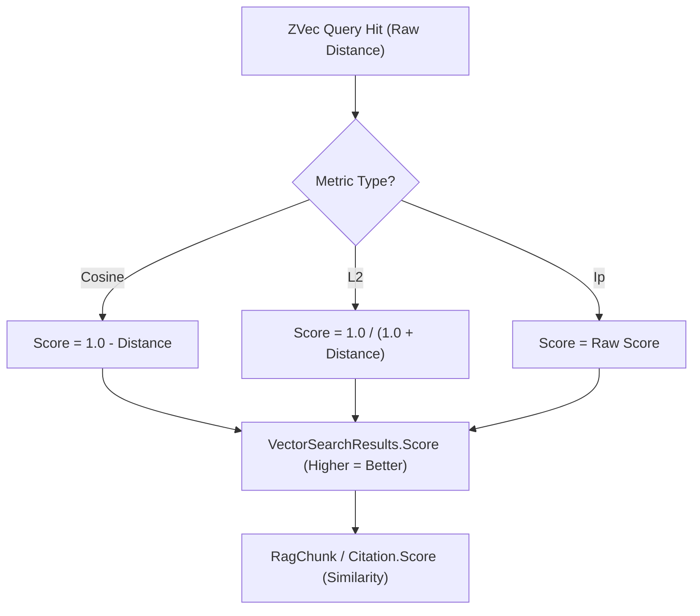

# Metric Score Semantics & Normalization

## Overview

A critical architectural distinction exists between native vector database search engines (such as `ZVec.NET`) and higher-level abstractions (such as `Microsoft.Extensions.VectorData` and RAG rankers):

- **ZVec Native Core:** Distance metrics (e.g. Cosine, L2) measure **dissimilarity / distance** where **lower values indicate closer matches** (0.0 = identical).
- **Microsoft.Extensions.VectorData & RAG Pipeline:** Search results expect **similarity scores** where **higher values indicate closer matches** (1.0 = identical).

Without transparent normalization, calling `VectorSearchResults<TRecord>.OrderByDescending(r => r.Score)` would return the worst matching items first, destroying retrieval quality.

---

## Mathematical Normalization Formulas

### 1. Cosine Distance $\rightarrow$ Cosine Similarity

In `ZVec.NET`, the `ZVecMetricType.Cosine` metric computes **Cosine Distance**:

$$
d_{\text{cosine}}(\mathbf{u}, \mathbf{v}) = 1 - \frac{\mathbf{u} \cdot \mathbf{v}}{\|\mathbf{u}\|_2 \|\mathbf{v}\|_2}
$$

For normalized vectors, \(d_{\text{cosine}} \in [0, 2]\). The `ZVec.Extensions.VectorData` connector normalizes this into **Cosine Similarity** \(s_{\text{cosine}} \in [-1, 1]\) (or scaled to \([0, 1]\)):

$$
s_{\text{cosine}} = 1.0 - d_{\text{cosine}}
$$

```csharp
// Dense vector search (ZVecScoreNormalizer.ToSimilarity):
float similarity = ZVecScoreNormalizer.ToSimilarity(nativeDistance, metricType);

// Hybrid RRF search: doc.Score is fused rank score — returned as-is (not re-normalized).
```

---

## Score Conversion Flowchart



---

## Hybrid Search Score Semantics

When executing **Hybrid Search** (combining Dense vectors with Full-Text Search lexical queries):

- **`ZVecRrfReranker` (Reciprocal Rank Fusion):** Default and recommended. Operates strictly on **ordinal ranks** (1st, 2nd, 3rd) rather than raw score magnitudes. Inherently robust against mixed score scales.
- **`ZVecWeightedReranker`:** Requires scores to be on identical scales. Do not mix un-normalized distance metrics with BM25 lexical scores.

```csharp
// Hybrid search via IKeywordHybridSearchable (ZVec.Extensions.VectorData):
IKeywordHybridSearchable<MyRecord> hybrid = collection;
var options = new ZVecHybridSearchOptions<MyRecord>
{
    RrfK = 60,
    Filter = r => r.Category == "books"
};

await foreach (var hit in hybrid.HybridSearchAsync(
    queryVector, keywords: new[] { "vector database" }, top: 10, options, ct))
{
    // hit.Score is raw RRF rank fusion — not cosine-normalized dense distance
    Console.WriteLine($"{hit.Record.Id} rrf={hit.Score}");
}
```

RAG hybrid retrieval sets `Citation.RankScore` from this fused RRF value; `Citation.DenseScore` and `Citation.FtsScore` are separate fields (Story 2.3.2).
