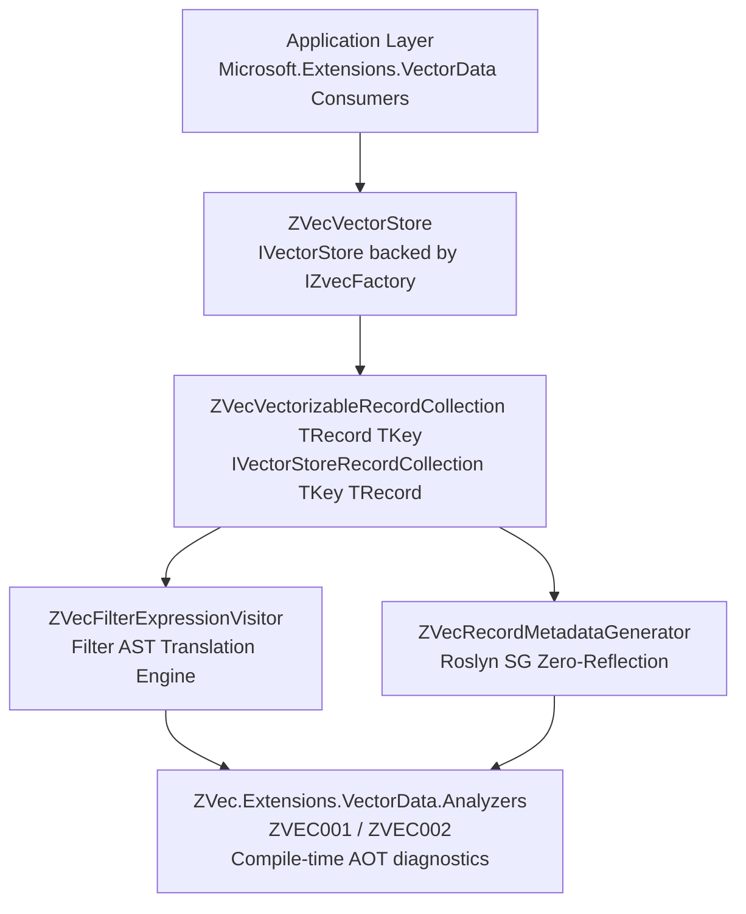
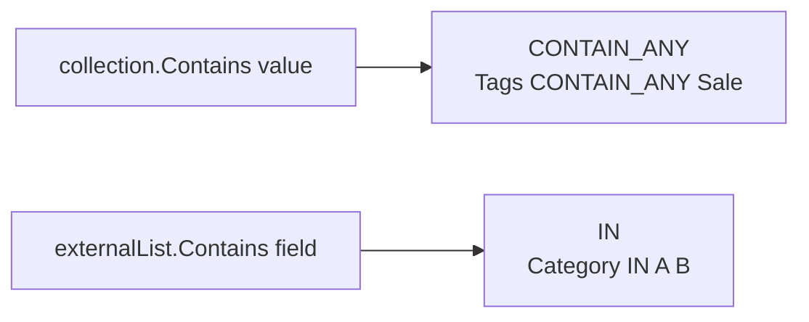

# VectorData Connector Architecture (`ZVec.Extensions.VectorData`)

`ZVec.Extensions.VectorData` provides a zero-allocation, Native AOT trim-safe implementation of Microsoft's official `Microsoft.Extensions.VectorData` specification over the embedded native vector DB engine `ZVec.NET`.

---

## 1. Component Map



---

## 2. Zero-Copy Vector Memory Pinning (`ZVecVectorizableRecordCollection`)

During `VectorizedSearchAsync<TVector>(TVector vector, VectorSearchOptions? options = null)`, input vectors of type `ReadOnlyMemory<float>` are processed using a dual-path zero-copy pin strategy:

```csharp
ReadOnlyMemory<float> floatVector = (ReadOnlyMemory<float>)vector;

if (MemoryMarshal.TryGetArray(floatVector, out ArraySegment<float> segment))
{
    // Fast path: Managed float[] backing array -> Pin directly via fixed statement (0 heap allocations)
    fixed (float* pVector = segment.Array.AsSpan(segment.Offset, segment.Count))
    {
        // Pass pVector directly to native zvec C API P/Invoke
    }
}
else
{
    // Fallback path: MemoryManager<T>-backed memory -> Rent buffer from ArrayPool<float>
    float[] rented = ArrayPool<float>.Shared.Rent(floatVector.Length);
    try
    {
        floatVector.Span.CopyTo(rented);
        fixed (float* pVector = rented)
        {
            // Pass pVector directly to native zvec C API P/Invoke
        }
    }
    finally
    {
        ArrayPool<float>.Shared.Return(rented);
    }
}
```

---

> [!NOTE]
> **Implementation Status Banner — Story 2.1 Complete**:
> `ZVecVectorizableRecordCollection<TRecord, TKey>` is fully wired to native `IZvecCollection` CRUD and search APIs with zero-copy memory pinning and score formula `Score = 1.0f - Distance`.

---

## 3. Central Package Management (CPM)

All NuGet package versions across the solution are managed centrally in `Directory.Packages.props`:

| Package | Purpose | Target Version |
|---|---|---|
| **`ZVec.NET`** | Native Embedded Vector DB Engine | `1.0.0-beta.6` |
| **`Microsoft.Extensions.VectorData.Abstractions`** | Official Vector Store Abstractions | `10.9.0` |
| **`SixLabors.ImageSharp`** | Cross-Platform Image Preprocessing | `3.1.7` |
| **`Microsoft.CodeAnalysis.CSharp`** | Roslyn Source Generator SDK | `4.12.0` |
| **`Microsoft.CodeAnalysis.Analyzers`** | Roslyn Analyzers SDK | `3.11.0` |
| **`ZVec.Extensions.VectorData.Analyzers`** | Compile-time AOT diagnostics (`ZVEC001`, `ZVEC002`) | Project reference |
| **`xunit.v3`** | Modern Executable Test Platform | `3.2.2` |
| **`xunit.runner.visualstudio`** | Visual Studio & VSTest Test Adapter | `3.1.5` |
| **`Microsoft.NET.Test.Sdk`** | .NET Test SDK Host | `18.8.1` |
| **`coverlet.collector`** | Code Coverage Collector | `10.0.1` |

---

## 4. Core Types & Implementation Files

### Store (`ZVec.Extensions.VectorData.Store`)

- **`ZVecVectorStore`**: [`src/ZVec.Extensions.VectorData/Store/ZVecVectorStore.cs`](../../src/ZVec.Extensions.VectorData/Store/ZVecVectorStore.cs)
- **`ZVecVectorStoreOptions`**: [`src/ZVec.Extensions.VectorData/Store/ZVecVectorStoreOptions.cs`](../../src/ZVec.Extensions.VectorData/Store/ZVecVectorStoreOptions.cs) — `EnableMmap`, `ReadOnly`, `MemoryLimitMb`, `DefaultQuantizeType`

### Collection (`ZVec.Extensions.VectorData.Collection`)

- **`ZVecVectorizableRecordCollection<TRecord, TKey>`**: [`src/ZVec.Extensions.VectorData/Collection/`](../../src/ZVec.Extensions.VectorData/Collection/) (partials: `.cs`, `.Schema.cs`, `.Mapping.cs`)

### Mapping (`ZVec.Extensions.VectorData.Mapping`)

- **`IZVecRecordMapper<TRecord>`**: [`src/ZVec.Extensions.VectorData/Mapping/IZVecRecordMapper.cs`](../../src/ZVec.Extensions.VectorData/Mapping/IZVecRecordMapper.cs)
- **`ZVecRecordMapperRegistry`**: [`src/ZVec.Extensions.VectorData/Mapping/ZVecRecordMapperRegistry.cs`](../../src/ZVec.Extensions.VectorData/Mapping/ZVecRecordMapperRegistry.cs)
- **`ZVecCollectionSchemaRegistry`**: [`src/ZVec.Extensions.VectorData/Mapping/ZVecCollectionSchemaRegistry.cs`](../../src/ZVec.Extensions.VectorData/Mapping/ZVecCollectionSchemaRegistry.cs)
- **`ZVecVectorDataSchemaBuilder`**: [`src/ZVec.Extensions.VectorData/Mapping/ZVecVectorDataSchemaBuilder.cs`](../../src/ZVec.Extensions.VectorData/Mapping/ZVecVectorDataSchemaBuilder.cs)
- **`ZVecVectorIndexResolver`**: [`src/ZVec.Extensions.VectorData/Mapping/ZVecVectorIndexResolver.cs`](../../src/ZVec.Extensions.VectorData/Mapping/ZVecVectorIndexResolver.cs) — maps `EmbeddingType` (`Half` → FP16), `DefaultQuantizeType`, and per-property `IndexKind` to HNSW params

### Filter (`ZVec.Extensions.VectorData.Filter`)

- **`ZVecFilterRecordModel`**: [`src/ZVec.Extensions.VectorData/Filter/ZVecFilterRecordModel.cs`](../../src/ZVec.Extensions.VectorData/Filter/ZVecFilterRecordModel.cs)
- **`ZVecFilterExpressionVisitor`**: [`src/ZVec.Extensions.VectorData/Filter/`](../../src/ZVec.Extensions.VectorData/Filter/) (partials: `.cs`, `.MethodCalls.cs`, `.Evaluation.cs`)

### Hybrid (`ZVec.Extensions.VectorData.Hybrid`)

- **`ZVecHybridSearchOptions<TRecord>`**: [`src/ZVec.Extensions.VectorData/Hybrid/ZVecHybridSearchOptions.cs`](../../src/ZVec.Extensions.VectorData/Hybrid/ZVecHybridSearchOptions.cs)

### Shared infrastructure

- **`ZVecFullTextSearchAttribute`**: [`src/ZVec.Extensions.VectorData/Attributes/ZVecFullTextSearchAttribute.cs`](../../src/ZVec.Extensions.VectorData/Attributes/ZVecFullTextSearchAttribute.cs)
- **`ZVecWellKnownMemberNames` / `ZVecDirectoryNames`**: [`src/ZVec.Extensions.VectorData/Constants/`](../../src/ZVec.Extensions.VectorData/Constants/)
- **`ZVecRecordMetadataGenerator`**: [`src/ZVec.Extensions.VectorData.SourceGenerator/`](../../src/ZVec.Extensions.VectorData.SourceGenerator/) (partials: `.cs`, `.Discovery.cs`, `.Emission.cs`)
- **`ZVec.Extensions.VectorData.Analyzers`**: [`src/ZVec.Extensions.VectorData.Analyzers/`](../../src/ZVec.Extensions.VectorData.Analyzers/) (`ZVecRecordMapperAnalyzer`, `ZVecReflectionHotPathAnalyzer`)
- **`ZVecFilterOperators`**: Enum covering 12 comparison, logical, collection, and null filter operators (`Equals`, `NotEquals`, `LessThan`, `LessThanOrEqual`, `GreaterThan`, `GreaterThanOrEqual`, `And`, `Or`, `Not`, `ContainsAny`, `IsNull`, `IsNotNull`).
- **`ZVecFilterErrorCode`**: Structured error codes carried by `ZVecFilterTranslationException` for programmatic filter translation error handling.
- **`ZVecErrorMessages`**: Strongly-typed error formatting helpers eliminating magic strings (field-aware remediation messages for unsupported string filter methods).
- **`ZVecVectorDataException`**: Base exception type for connector operations.

---

## 5. Schema Emission Precedence (`BuildCollectionSchema`)

Native collection schemas are resolved in this order (no reflection on the hot path when SG or caller definition is present):

1. **Source-generated factory** — `{Record}ZVecMetadataMapper.BuildSchema(collectionName)` registered in `ZVecCollectionSchemaRegistry` via `[ModuleInitializer]`.
2. **Caller `VectorStoreCollectionDefinition`** — passed to `GetCollection` / collection ctor, mapped by `ZVecVectorDataSchemaBuilder.BuildFromDefinition`.
3. **Annotated reflection fallback** — `ZVecCollectionSchemaBuilder.From<TRecord>()` with `[RequiresUnreferencedCode]` / `[RequiresDynamicCode]` (legacy `[ZVec*]` attributes).

After schema resolution, `ZVecVectorIndexResolver.ApplyStoreVectorOptions` applies `DefaultQuantizeType` from `ZVecVectorStoreOptions` to HNSW vector definitions (immutable schema rebuild).

Consumer projects (tests, `ZVec.AotTestApp`, samples) must reference the source generator as an analyzer:

```xml
<ProjectReference Include="path/to/ZVec.Extensions.VectorData.SourceGenerator.csproj"
                  OutputItemType="Analyzer"
                  ReferenceOutputAssembly="false" />
```

---

## 6. Filter Expression Translation (`ZVecFilterExpressionVisitor`)

`ZVecFilterExpressionVisitor` translates `Expression<Func<TRecord, bool>>` LINQ predicates into native `ZVecFilterBuilder` AST nodes and SQL-style filter strings.

### Supported Operators (12)

| LINQ Pattern | ZVec AST | Example |
|---|---|---|
| `==` | `Where(Eq)` | `x.Category == "Books"` |
| `!=` | `Where(Ne)` | `x.Category != "Draft"` |
| `<`, `<=`, `>`, `>=` | `Where(Lt/Le/Gt/Ge)` | `x.Price < 100` |
| `&&` | `And` | `x.InStock && x.Price < 50` |
| `\|\|` | `Or` | `x.Category == "A" \|\| x.Category == "B"` |
| `!` | `Not` / bool negation | `!x.InStock` |
| `x.Tags.Contains(value)` | `ContainAny` | `x.Tags.Contains("Sale")`, `x.NumberTags.Contains(42)`, `Enumerable.Contains(x.Tags, "Sale")`, `List<string>.Contains` on record properties |

**ContainAny typed value dispatch:** `int`, `long`, `float`, `double`, `bool`, `string`, `Guid`, `DateTime`, `DateTimeOffset` (unsupported collection field types such as `Guid[]` remain a schema limitation; scalar `Guid` values are supported in `ContainAny`).

| `values.Contains(x.Field)` | `In` | `allowed.Contains(x.Category)` |
| `== null` / `!= null` | `IsNull` / `IsNotNull` | `x.Category == null` |

### Contains Pattern Disambiguation



```text
x.CollectionProperty.Contains(value)  -->  Tags CONTAIN_ANY ("Sale")
externalList.Contains(x.ScalarField)  -->  Category IN ("A", "B")
```

Unsupported string methods (`StartsWith`, `EndsWith`, `Regex.IsMatch`, `string.Contains`) throw `ZVecFilterTranslationException` with **`ZVecFilterErrorCode`** and field-aware remediation guidance pointing to ZVec FTS keyword search (for example: `Field 'Category': StartsWith is not supported...`).

User-defined implicit/explicit conversion operators (outside approved BCL conversions and `ReadOnlySpan` array bridges) throw `ZVecFilterTranslationException` with `UnsupportedUserDefinedConversion`.

---

## 7. Score Normalization, Index Optimization & Native AOT Safety

- **Score Normalization Formula:** ZVec native scores are normalized transparently using a metric-switch formula:
  - **Cosine Metric:** \(\text{Score} = 1.0f - d_{\text{cosine}}\) (maps distance \([0, 2]\) to similarity \([-1, 1]\))
  - **L2 Metric:** \(\text{Score} = \frac{1.0f}{1.0f + d_{\text{L2}}}\) (monotonically maps distance \([0, \infty)\) to similarity \((0, 1]\))
  - **InnerProduct Metric:** \(\text{Score} = d_{\text{IP}}\) (passthrough value)
- **Index Optimization & Reopen Lifecycle (`OptimizeAndReopenAsync`):** To prevent stale-querier C++ engine errors post-optimization, `OptimizeAndReopenAsync()` runs native optimization **outside** the synchronization lock, then performs a short critical section that disposes the previous handle, releases the native `LOCK` file, and reopens a fresh handle. Because ZVec enforces a single read-write handle per collection path, dispose-then-reopen must remain inside the lock (a pre-opened second handle would deadlock on the native `LOCK` file). If reopen fails after dispose, `_nativeCollection` is cleared and the exception propagates; subsequent operations recover via lazy reopen in `GetOrOpenNativeCollection()`.
- **Async occupancy (`*Async` CRUD/search):** Connector methods delegate to ZVec.NET engine APIs documented as cancellation-aware wrappers around synchronous native P/Invoke (not thread-pool offloads). The caller thread is occupied until the first **incomplete** engine gate `WaitAsync`. When the native `ValueTask` is already complete, `await` does not yield and P/Invoke has already run on that caller. `ConfigureAwait(false)` does not shorten native occupancy. `EnsureCollectionExistsAsync` uses `ConfigureAwaitOptions.ForceYielding` before sync `OpenOrCreate` inside `GetOrOpenNativeCollection` (no `await` while holding `_initLock`).
- **FTS Attribute Precedence:** Full-text search indexing is resolved per string property with explicit precedence:
  1. `[ZVecFullTextSearch]` — ZVec-specific source of truth when present (`IsFullTextIndexed` controls enable/disable).
  2. `[VectorStoreData(IsFullTextIndexed = true)]` — fallback for M.E.VectorData consumers when no ZVec FTS attribute is declared.
- **Native AOT & Trim Safety:** All runtime record mapping uses Roslyn Source Generator emitted zero-reflection mappers (`IZVecRecordMapper<TRecord>`). The dynamic reflection fallback is annotated with `[RequiresUnreferencedCode]` and `[RequiresDynamicCode]` to ensure Native AOT trim warnings trigger cleanly if an ungenerated record type is used. Compile-time enforcement is provided by **`ZVec.Extensions.VectorData.Analyzers`** (`ZVEC001`, `ZVEC002`) and CI quality gates in `.github/workflows/quality-gate.yml`.


