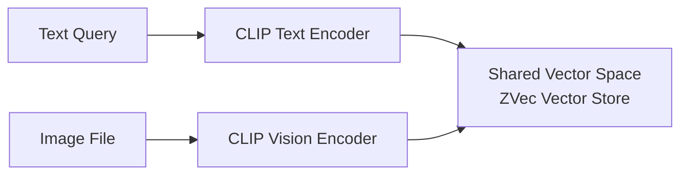

# Multimodal RAG (Text + Image) Pipeline Guide

This guide describes how to implement multimodal Retrieval-Augmented Generation (text queries retrieving image chunks or joint image-text embeddings) using `ZVec.Rag.ONNX` and CLIP models.

---

## 🖼️ Multimodal Architecture

CLIP (Contrastive Language-Image Pre-Training) maps both text prompts and images into a shared multi-dimensional vector space.



---

## ⚡ Image Preprocessing (`ClipImagePreprocessor`)

`ZVec.Rag.ONNX` ships `ClipImagePreprocessor` with CLIP mean/std in `OnnxConstants` (no magic numbers in app code):

```csharp
using ZVec.Rag.ONNX;
using ZVec.Rag.ONNX.Schema;

var preprocessor = new ClipImagePreprocessor();
DenseTensor<float> tensor = preprocessor.Preprocess(imageStream, targetSize: 224);
```

---

## 🔌 DI registration

```csharp
services.AddZVecRag(opts => { /* StoragePath, Chat */ })
    .AddTokenChunker();

services.AddZVecRagOnnxEmbedder(o =>
{
    o.ModelPath = textOnnxPath;
    o.ModelKind = OnnxEmbeddingModelKind.ClipText;
    o.Dimensions = OnnxConstants.ClipDimensions;
    o.VisionModelPath = visionOnnxPath; // required for EmbedImageAsync
});
```

Use `ZVecRagMultimodalRecordV1` (512-d, `SourceKind`) for CLIP collections. One embedder model per collection (Story 1.11 manifest stamp). Default `IRagPipeline` / `ZVecRagRecordV1` remains 768-d text-only.

Embed-stage telemetry: `ZVecRagTelemetry` records `stage=embed` token usage when `GeneratedEmbeddings.Usage` is present.

---

## 🖥️ Platform Scope & Model Distribution

> [!IMPORTANT]
> - **Desktop Only (Windows / Linux / macOS)**: Multimodal CLIP models (~600 MB ONNX file size) and ONNX Runtime execution providers are intended for Desktop and Server scenarios. They are **not recommended for mobile app distribution**.
> - **One embedder per collection**: CLIP text and image vectors share one space by design. Do **not** mix CLIP with MiniLM in one collection — use Story 1.11 embedder stamp (`ModelId` + dimensions) to enforce consistency.
> - **No `[ZVecModality]` source generator**: Use an ordinary indexed POCO field `SourceKind` (`text` | `image`) for UI/citations. Filter with LINQ (`r => r.SourceKind == "image"`) only when the product wants unimodal results — not inside `SearchAsync` by default.
> - **Model File Provisioning**: ONNX model files are not embedded inside NuGet packages to keep download sizes small. Application developers must supply model file paths or download models dynamically on first launch.
