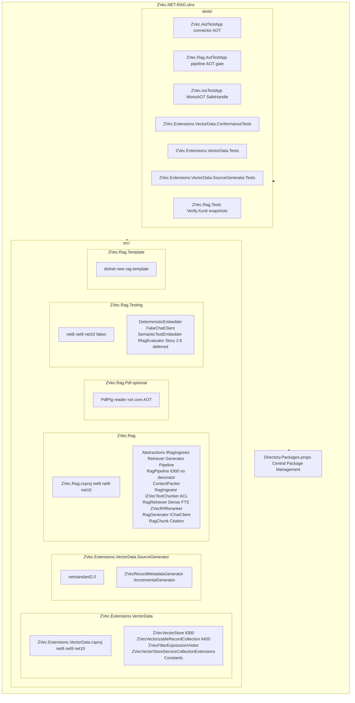

# ZVec.NET-RAG Master Project Implementation Plan & Technical Spec

> 🔒 **LOCKED MASTER SPECIFICATION & EXECUTION PLAN** (`project_tasks_implementation_plan.md` — Gitignored).
> **Locking Governance Rule**: This document is officially reviewed and approved by all 6 Expert Personas. It MUST NOT be modified during execution except for:
> 1. Checking off completed task boxes (`[x]`).
> 2. Updating task specs if an unforeseen technical blocker requires formal restudy and approval.
>
> Target Ecosystem: .NET 8 / 9 / 10 | Core Native Engine: ZVec.NET v1.0.0-beta.5 | License: Apache-2.0
> Author: Ahmed Samir (`ahmedsamir50`) | Organization: Adam Systems
> Primary Goals: Build `ZVec.Extensions.VectorData` (v1 centerpiece) + `ZVec.Rag` (starter kit) + `ZVec.Rag.Template`.
> Solution Architecture: Single Solution (`ZVec.NET-RAG.slnx`) containing all projects with Central Package Management (`Directory.Packages.props`).

---

## 🏛️ Governance, Quality Gates & Persona Responsibilities

Every User Story and Task in this implementation plan MUST pass audit by the designated Expert Persona:

- 📐 **`zvec-architect-strategy-expert`**: Product positioning ("No cloud, no Python, no kidding"), kill criteria monitoring, developer onboarding (`dotnet new rag`), enterprise vs OSS licensing, risk mitigation options with Pros/Cons.
- 🔌 **`zvec-vectordata-expert`**: Conformance to `Microsoft.Extensions.VectorData`, AST filter translation (`VectorDataFilter` -> `ZVecFilterBuilder`), Roslyn Source Generation, schema mappings.
- ⚡ **`zvec-rag-pipeline-expert`**: Integration with `M.E.AI`, hybrid search (dense + FTS + RRF), citation tracking, SSE streaming, MAUI/ASP.NET recipes, test fakes. Chunking uses in-repo `IZVecTextChunker` ACL (no `M.E.DataIngestion` PackageReference).
- 🛡️ **`zvec-native-aot-expert`**: Native interop with ZVec C++ core, `SafeZvecHandle` lifecycle, zero-copy memory pinning, Native AOT trim auditing, 9 multi-platform RIDs.
- 🕵️ **`zvec-code-reviewer-expert`**: TDD compliance, 100% path coverage auditing, zero magic strings, strict SOLID & <500 lines enforcement, XML doc & code illustration audit, MkDocs wiki sync, **Zero Dummy Test Enforcement**.
- 🚀 **`zvec-performance-expert`**: Zero-allocation hot paths, BenchmarkDotNet profiling, memory pinning, GC pressure minimization, ArrayPool reuse, cache efficiency.

---

## 🧱 Non-Negotiable Engineering Rules

1. **Zero Dummy / Fake / Placeholder Tests**: ABSOLUTELY NO `Assert.True(true)`, empty stubs, or superficial 2-line shortcuts. Every test case MUST be an honest, full test case asserting real behavior, contract adherence, parameter validation, edge cases, and exception paths.
2. **"Never Blindly Agree" Rule**: Evaluate risks, edge cases, and drawbacks. Present solutions with explicit **Options, Pros, and Cons / Drawbacks**.
3. **Strict SOLID & 500-Line Class Limit**: Every class must strictly adhere to SOLID principles and MUST NOT exceed 500 lines of code. Decompose into single-responsibility sub-components and interfaces.
4. **TDD Mandatory Workflow**: Red $\rightarrow$ Green $\rightarrow$ Refactor. Write failing unit tests BEFORE implementation code for all public and internal methods.
5. **100% Path Test Coverage**: Every public method must be tested across **all execution paths**, edge cases, and exception conditions. Abstractions must have at least one honest full test case.
6. **No Magic / Hardcoded Strings**: All string literals for filters, configs, errors, and collections are strictly banned; enums or static constant classes (`ZVecConstants`, `ZVecFilterOperators`, `ZVecErrorMessages`) are mandatory.
7. **Universal XML Docs & Code Illustrations**: 100% XML comments on all public, protected, and internal APIs, PLUS inline code illustrations/ASCII flow diagrams for hot/complex/critical paths for human clarity.
8. **Code Reviewer Approval Gate**: All code modifications must pass review by `zvec-code-reviewer-expert`.
9. **MkDocs Wiki Synchronous Updates**: Documentation in `docs/` (`mkdocs.yml`) must be kept up-to-date after every single approved code change.
10. **Read-Only ZVec.NET Reference**: The reference `ZVec.NET` repository (`ahmedSamir50/AdamSystems.ZVec.NET`) is used for reference/verification ONLY and must NEVER be modified by this workspace.

---

## 📐 Master Solution & Project Layout (`ZVec.NET-RAG.slnx`)



```
ZVec.NET-RAG.slnx
 ├── Directory.Packages.props (Central Package Management - CPM)
 ├── src/
 │    ├── ZVec.Extensions.VectorData/
 │    │    └── ZVec.Extensions.VectorData.csproj (TFMs: net8.0;net9.0;net10.0)
 │    │         ├── ZVecVectorStore.cs (IVectorStore implementation, <300 lines)
 │    │         ├── ZVecVectorizableRecordCollection.cs (IVectorStoreRecordCollection implementation, <450 lines)
 │    │         ├── ZVecFilterExpressionVisitor.cs (VectorDataFilter -> ZVecFilterBuilder AST)
 │    │         ├── ZVecVectorStoreServiceCollectionExtensions.cs (DI registrations)
 │    │         └── Constants/ (ZVecFilterOperators, ZVecErrorMessages, ZVecConstants)
 │    ├── ZVec.Extensions.VectorData.SourceGenerator/
 │    │    └── ZVec.Extensions.VectorData.SourceGenerator.csproj (TFM: netstandard2.0)
 │    │         └── ZVecRecordMetadataGenerator.cs (IIncrementalGenerator for [VectorStoreRecord] POCOs)
 │    ├── ZVec.Rag/
 │    │    └── ZVec.Rag.csproj (TFMs: net8.0;net9.0;net10.0)
 │    │         ├── Abstractions/ (IRagIngestor, IRagRetriever, IRagGenerator, IRagPipeline)
 │    │         ├── RagPipeline.cs (Composite facade, <300 lines — no decorator middleware)
 │    │         ├── Generation/ContextPacker.cs (token budget + optional Lost-in-the-Middle reorder)
 │    │         ├── Ingestion/RagIngestor.cs (text/md core; in-repo IZVecTextChunker ACL)
 │    │         ├── Retrieval/RagRetriever.cs (Dense + FTS + ZVecRrfReranker)
 │    │         ├── Generation/RagGenerator.cs (M.E.AI IChatClient integration)
 │    │         └── Streaming/RagChunk.cs & Citation.cs
 │    ├── ZVec.Rag.Pdf/ (optional — PdfPig document reader, not in core AOT path)
 │    │    └── ZVec.Rag.Pdf.csproj
 │    ├── ZVec.Rag.Testing/
 │    │    └── ZVec.Rag.Testing.csproj (TFMs: net8.0;net9.0;net10.0 — Unit testing fakes)
 │    │         ├── DeterministicEmbedder.cs (hash-based test embedder)
 │    │         └── FakeChatClient.cs (dual streaming/non-streaming test chat client)
 │    │         # SemanticTestEmbedder / IRagEvaluator — Story 2.8 (not shipped yet)
 │    └── ZVec.Rag.Template/
 │         └── ZVec.Rag.Template.csproj (dotnet new rag project template)
 └── tests/
      ├── ZVec.AotTestApp/ (Exe - Native AOT publish verification — connector only)
      ├── ZVec.Rag.AotTestApp/ (Exe - Phase 2 RAG pipeline AOT gate: M.E.AI + Tokenizers + text ingest)
      ├── ZVec.IosTestApp/ (Exe - iOS MonoAOT SafeHandle finalizer thread audit)
      ├── ZVec.Extensions.VectorData.ConformanceTests/ (xUnit - M.E.VectorData Contract Conformance)
      ├── ZVec.Extensions.VectorData.Tests/ (xUnit - Connector & AST visitor tests)
      ├── ZVec.Extensions.VectorData.SourceGenerator.Tests/ (xUnit - Roslyn SG GeneratorVerifier tests)
      └── ZVec.Rag.Tests/ (xUnit - RAG Pipeline & Snapshot tests via Verify.Xunit)
```

---

## 📅 Phased Epic & User Story Breakdown

---

### Phase 0: Preconditions & Audit Gating (Weeks 1–2) — 100% COMPLETED ✅

> [!IMPORTANT]
> **Phase 0 Status**: Phase 0 is 100% complete and approved by `zvec-native-aot-expert` and `zvec-architect-strategy-expert`.

#### Epic 0: Native AOT Audit, Conformance Setup & Workspace Baseline

- [x] **Story 0.1: Add License to Demos & POCs Repo** (Owner: `zvec-architect-strategy-expert`)
  - [x] **Task 0.1.1**: Add Apache-2.0 `LICENSE` file to `zvec.net_demo` to clean code sharing.
  - [x] **Task 0.1.2**: Audit third-party assets in demos repo for license compatibility.
  - **Acceptance Criteria**: Demos repo explicitly licensed under Apache-2.0.

- [x] **Story 0.2: ZVec.NET Native AOT & Trimming Static Audit** (Owner: `zvec-native-aot-expert`)
  - [x] **Task 0.2.1**: Perform static audit on `ZVec.NET` public API surface for dynamic code / reflection calls.
  - [x] **Task 0.2.2**: Document dynamic access points and fixes in `docs/reference/zvec-net-aot-recommendations.md`.
  - [x] **Task 0.2.3**: Create `tests/ZVec.AotTestApp` configured with `<PublishAot>true</PublishAot>` and `<TreatWarningsAsErrors>true</TreatWarningsAsErrors>`.
  - [x] **Task 0.2.4**: Run `dotnet publish -c Release -r win-x64` on `ZVec.AotTestApp` against `ZVec.NET 1.0.0-beta.5`. Verified 100% successful execution across model resolution, document conversion, vector pinning, and POCO restoration under Native AOT.
  - **Acceptance Criteria**: Native AOT binary built and executed successfully; 100% test pass.

- [x] **Story 0.3: M.E.VectorData Conformance Test Harness Setup** (Owner: `zvec-vectordata-expert`)
  - [x] **Task 0.3.1**: Create `tests/ZVec.Extensions.VectorData.ConformanceTests` referencing `Microsoft.Extensions.VectorData.Abstractions` (`10.9.0` via CPM).
  - [x] **Task 0.3.2**: Wire up contract test fixtures for `IVectorStore`, `IVectorizedSearch<TRecord>`, and `IVectorStoreRecordCollection<TKey, TRecord>` with honest property metadata tests.
  - **Acceptance Criteria**: Test harness compiles and passes baseline contract tests (`1 Passed, 0 Failed`).

- [x] **Story 0.4: Ecosystem Watch & Kill Criteria Monitor** (Owner: `zvec-architect-strategy-expert`)
  - [x] **Task 0.4.1**: Check `microsoft/semantic-kernel#13224` (LiteDB/embedded connector requests) and `microsoft/agent-framework#1395` (persistent agent memory).
  - [x] **Task 0.4.2**: Document ecosystem baseline status in `docs/reference/dependencies.md`.
  - **Acceptance Criteria**: Ecosystem watchlist updated and verified in `docs/reference/dependencies.md`.

- [x] **Story 0.5: MkDocs Wiki Baseline Verification** (Owner: `zvec-code-reviewer-expert`)
  - [x] **Task 0.5.1**: Create and verify all baseline documentation pages under `docs/` (`index.md`, `architecture/*`, `guides/*`, `reference/*`).
  - **Acceptance Criteria**: MkDocs site structure completely populated and synchronized.

---

### Phase 1: `ZVec.Extensions.VectorData` Connector & Source Generator (Weeks 3–7) — RE-OPENED FOR HARDENING 🔄

#### Epic 1: `ZVec.Extensions.VectorData` Connector Implementation

- [x] **Story 1.1: Phase 1 Solution & Project Setup** (Owner: `zvec-architect-strategy-expert`, Reviewer: `zvec-code-reviewer-expert`) ✅
  - [x] **Task 1.1.1**: Create `src/ZVec.Extensions.VectorData/ZVec.Extensions.VectorData.csproj` referencing `Microsoft.Extensions.VectorData.Abstractions` and `ZVec.NET`.
  - [x] **Task 1.1.2**: Create `src/ZVec.Extensions.VectorData.SourceGenerator/ZVec.Extensions.VectorData.SourceGenerator.csproj` targeting `netstandard2.0`.
  - [x] **Task 1.1.3**: Create `tests/ZVec.Extensions.VectorData.Tests/ZVec.Extensions.VectorData.Tests.csproj`.
  - [x] **Task 1.1.4**: Add all projects to `ZVec.NET-RAG.slnx` and set up `Directory.Packages.props` for Central Package Management (CPM).
  - **Acceptance Criteria**: `dotnet build ZVec.NET-RAG.slnx` succeeds with 0 warnings.

- [x] **Story 1.2: Constants & Exception Hierarchy (Zero Magic Strings)** (Owner: `zvec-vectordata-expert`, Reviewer: `zvec-code-reviewer-expert`) ✅
  - [x] **Task 1.2.1 (TDD)**: Write unit tests in `ZVecConstantsTests.cs` verifying string constant immutability, formatting helpers, and enum mapping bounds.
  - [x] **Task 1.2.2**: Implement `ZVecFilterOperators` enum (`Equals`, `NotEquals`, `LessThan`, `LessThanOrEqual`, `GreaterThan`, `GreaterThanOrEqual`, `And`, `Or`, `Not`, `ContainsAny`, `IsNull`, `IsNotNull`).
  - [x] **Task 1.2.3**: Implement `ZVecErrorMessages` static class containing strongly-typed error string formats.
  - [x] **Task 1.2.4**: Implement `ZVecVectorDataException` and `ZVecFilterTranslationException` with complete XML docs.
  - **Acceptance Criteria**: 100% path coverage; 0 magic strings in codebase.

- [x] **Story 1.3: Core `ZVecVectorStore` Implementation — RE-OPENED (DS risk verdict)** (Owner: `zvec-vectordata-expert`, Reviewer: `zvec-code-reviewer-expert`) ✅
  - [x] **Task 1.3.1 (TDD)**: Write unit tests in `ZVecVectorStoreTests.cs` covering collection creation, listing, existence checks, deletion, and invalid parameter validation.
  - [x] **Task 1.3.2**: Implement `ZVecVectorStore : IVectorStore` backed by `IZvecFactory`. Class size strictly capped <300 lines.
  - [x] **Task 1.3.3**: Add XML documentation (`/// <summary>`) and inline ASCII flow diagram of collection-to-ZVec mapping.
  - [x] **Task 1.3.4 (DS)**: Extend `ZVecVectorStoreOptions` with `EnableMmap` (default `true`), `ReadOnly`, `MemoryLimitMb`, and `DefaultQuantizeType`; map to `ZVecOptions` / `ZVecCollectionOptions`.
  - **Acceptance Criteria**: 100% path test coverage; class length <300 lines; mobile mmap options plumbed.

- [x] **Story 1.4: `ZVecVectorizableRecordCollection<TRecord, TKey>` Implementation — RE-OPENED (DS risk verdict)** (Owner: `zvec-vectordata-expert`, Reviewer: `zvec-native-aot-expert`) ✅
  - [x] **Task 1.4.1 (TDD)**: Write unit tests in `ZVecVectorizableRecordCollectionTests.cs` covering `GetAsync`, `GetBatchAsync`, `UpsertAsync`, `UpsertBatchAsync`, `DeleteAsync`, `DeleteBatchAsync`, and `VectorizedSearchAsync`.
  - [x] **Task 1.4.2**: Implement `ZVecVectorizableRecordCollection<TRecord, TKey> : IVectorStoreRecordCollection<TKey, TRecord>`. Class size strictly capped <450 lines.
  - [x] **Task 1.4.3**: Ensure vector pass-through uses `ReadOnlyMemory<float>` pin path with `MemoryMarshal.TryGetArray` fast path and `ArrayPool<float>` fallback.
  - [x] **Task 1.4.4**: Implement `OptimizeAndReopenAsync()` to execute native index optimization, safely release native handle lock file, and reopen fresh collection handle. Verified in `ZVecOptimizeReopenTests.cs`.
  - [x] **Task 1.4.5 (DS)**: Pass `ZVecCollectionOptions` (`EnableMmap`, `ReadOnly`) from `ZVecVectorStoreOptions` into `OpenOrCreate`; verify via `ZVecCollectionOptionsPlumbingTests.cs`.
  - **Acceptance Criteria**: 100% path coverage; zero heap allocations on vector query paths for managed array embedders; atomic handle refresh post-optimization.

- [x] **Story 1.5: Filter Expression Visitor (`VectorDataFilter` -> `ZVecFilterBuilder`) — RE-OPENED** (Owner: `zvec-vectordata-expert`, Reviewer: `zvec-code-reviewer-expert`) ✅
  - [x] **Task 1.5.1 (TDD)**: Write unit tests in `ZVecFilterExpressionVisitorTests.cs` covering all filter operators (`==`, `!=`, `<`, `<=`, `>`, `>=`, `&&`, `||`, `!`, `ContainsAny`, `IsNull`, `IsNotNull`), plus `Enumerable.Contains` / `List<T>.Contains` pattern matching.
  - [x] **Task 1.5.2**: Update `ZVecFilterExpressionVisitor` AST translator to map `Enumerable.Contains` on array/collection properties to `ZVecFilterBuilder.ContainAny(...)`.
  - [x] **Task 1.5.3**: Add diagnostic error handling throwing `ZVecFilterTranslationException` with explicit remediation for unsupported LINQ expressions (`StartsWith`, `EndsWith`).
  - [x] **Task 1.5.4**: Add ASCII AST tree diagram in code comments illustrating expression translation steps.
  - **Acceptance Criteria**: All 12 filter operators supported with 100% branch test coverage.

- [x] **Story 1.6: Roslyn Source Generator `ZVecRecordMetadataGenerator` — CLOSED** (Owner: `zvec-vectordata-expert`, Reviewer: `zvec-native-aot-expert`) ✅
  - [x] **Task 1.6.1 (TDD)**: Write generator tests in `ZVecRecordMetadataGeneratorTests.cs` using Roslyn CSharpCompilation and GeneratorDriver harness.
  - [x] **Task 1.6.2**: Implement `ZVecRecordMetadataGenerator : IIncrementalGenerator` inspecting `[VectorStore*]` attributes.
  - [x] **Task 1.6.3**: Emit zero-reflection static metadata mappers (`IZVecRecordMapper<TRecord>`) AND static schema registration methods calling `AddField(...)` / `AddVector(...)` directly to bypass `ZVecCollectionSchemaBuilder.From<T>()` reflection.
  - [x] **Task 1.6.4**: Verify generated code compiles under Native AOT (`ZVec.AotTestApp` harness; SG path 0 unexpected trim warnings; reflection fallback surfaces IL2026/IL3050 by design).
  - [x] **Task 1.6.5 (DS)**: Emit vectors via `ZVecVectorIndexResolver` (FP32 default; `EmbeddingType = Half` → FP16 storage; `DefaultQuantizeType` on HNSW). Tests in `ZVecVectorIndexResolverTests.cs`.
  - **Acceptance Criteria**: AOT-clean schema generation and record mapping with 0 reflection at runtime; quantization plumbed without custom MS `VectorDataType`.

- [x] **Story 1.7: Hybrid Search Bridge & DI Extensions — RE-OPENED (DS risk verdict)** (Owner: `zvec-vectordata-expert`, Reviewer: `zvec-performance-expert`) ✅
  - [x] **Task 1.7.1 (TDD)**: Write unit tests for hybrid dense vector + FTS queries in `ZVecHybridSearchTests.cs`.
  - [x] **Task 1.7.2**: Implement `IKeywordHybridSearchable<TRecord>` bridge in `ZVecVectorizableRecordCollection` with normalized `Score = 1.0f - ZVecDistance` for Cosine.
  - [x] **Task 1.7.3 (TDD)**: Test `services.AddZVecVectorStore(...)` DI configuration options in `ZVecVectorStoreServiceCollectionExtensionsTests.cs`.
  - [x] **Task 1.7.4**: Implement `ZVecVectorStoreServiceCollectionExtensions` defaulting `MaxConcurrentNativeCalls = Environment.ProcessorCount`.
  - [x] **Task 1.7.5**: Run full `ZVec.Extensions.VectorData.ConformanceTests` suite.
  - [x] **Task 1.7.6**: Sync MkDocs wiki (`docs/architecture/vectordata-connector.md`, `hybrid-search-rrf.md`, `di-composition.md`).
  - [x] **Task 1.7.7 (DS)**: Verify `AddZVecVectorStore` binds `EnableMmap`, `ReadOnly`, `MemoryLimitMb`, and `DefaultQuantizeType` in `ZVecVectorStoreServiceCollectionExtensionsTests.cs`.
  - **Acceptance Criteria**: Pass 100% conformance tests; code reviewer approval achieved; MkDocs wiki updated.

---

### Phase 1.5: Architectural Mitigation & Risk Hardening Sprint (Weeks 8–10)

#### Epic 1.5: Core Connector & Interop Risk Hardening

- [x] **Story 1.8: VectorData Score Normalization (Distance $\rightarrow$ Similarity)** (Owner: `zvec-vectordata-expert`, Reviewer: `zvec-code-reviewer-expert`) ✅
  > **Note:** This is **score normalization** (Cosine/L2/Ip distance → similarity). Project-plan Epic 1 **1.8** checkbox = DI extensions (`AddZVecVectorStore`) — already done. Do not conflate the two.
  - [x] **Task 1.8.1 (TDD)**: Write unit tests in `ZVecScoreNormalizationTests.cs` and `ZVecScoreNormalizerTests.cs` asserting Cosine, L2, and Ip conversion.
  - [x] **Task 1.8.2**: Implement `ZVecScoreNormalizer`; dense `SearchAsync` uses normalized similarity; hybrid RRF scores returned as-is.
  - **Acceptance Criteria**: 100% path coverage; higher similarity vectors strictly return higher score values.

- [x] **Story 1.9: Filter AST Visitor Expansion (`Enumerable.Contains` $\rightarrow$ `ContainAny`) — DUPLICATE OF STORY 1.5 (closed)** (Owner: `zvec-vectordata-expert`, Reviewer: `zvec-code-reviewer-expert`) ✅
  - [x] **Task 1.9.1 (TDD)**: Write unit tests in `ZVecFilterExpressionVisitorTests.cs` for `Enumerable.Contains` and `List<T>.Contains` mapping to `ContainAny`. *(Delivered under Story 1.5 Task 1.5.1.)*
  - [x] **Task 1.9.2**: Update `ZVecFilterExpressionVisitor` to inspect `MethodCallExpression` on collection properties and generate `ZVecFilterBuilder.ContainAny`. Throw `ZVecFilterTranslationException` with diagnostic instructions for unsupported methods (`StartsWith`, `EndsWith`). *(Delivered under Story 1.5 Tasks 1.5.2–1.5.3.)*
  - **Acceptance Criteria**: `Tags.Contains("tag")` LINQ expressions translate to valid `ZVecFilterBuilder.ContainAny` AST.

- [ ] **Story 1.10: iOS MonoAOT & SafeHandle Finalizer Interop Audit** (Owner: `zvec-native-aot-expert`, Reviewer: `zvec-code-reviewer-expert`)
  > **Note:** This is **iOS MonoAOT / SafeHandle finalizer** audit. Project-plan Epic 1 **1.10** checkbox = AOT/trim CI (`ZVec.AotTestApp`) — already done. Do not conflate the two.
  - **Task 1.10.1 (DEFERRED — owner: `zvec-native-aot-expert`)**: Create `tests/ZVec.IosTestApp` harness executing P/Invoke calls and `zvec_collection_close` under MonoAOT linking (`<MtouchLink>Full</MtouchLink>`). **CI (when harness exists):** macOS runner compiles `iossimulator-arm64` only. **Simulator launch + GC finalizer stress** remains deferred until a physical/simulator run is available. Portable finalizer stress delivered in Task 1.10.2 via `ZVec.Extensions.VectorData.Tests`.
  - [x] **Task 1.10.2**: Run finalizer thread safety audit creating 1,000 collection handles, forcing GC, and verifying 0 deadlocks or pointer crashes (`ZVecFactoryShutdownTests`). Hook `IZvecFactory.Shutdown()` to `IHostApplicationLifetime.ApplicationStopping` via `AddZVecVectorStore`.
  - **Acceptance Criteria**: Portable harness passes without deadlocks; iOS physical gate remains deferred until Task 1.10.1.

- [x] **Story 1.11: Embedder Stamp Manifest & Index Schema Locking** (Owner: `zvec-vectordata-expert`, Reviewer: `zvec-architect-strategy-expert`) ✅
  > **Note:** This is the **embedder stamp** story. Project-plan Epic 1.11 checkbox = InMemory migration wiki (done). Do not conflate the two.
  - [x] **Task 1.11.1 (TDD)**: Write unit tests verifying creation and validation of `zvec_index_manifest.json` (`ModelId`, `Dimensions`, `QuantizeType`, embedding storage dtype, `CreatedUtc`).
  - [x] **Task 1.11.2**: Implement `ZVecIndexManifestManager` to write manifest on initial collection creation and throw `ZVecEmbedderMismatchException` on startup when `ModelId`, `Dimensions`, or `QuantizeType`/storage dtype mismatch. Message must include expected vs actual values and collection storage path. Quantize/schema changes require delete + re-ingest or `IRagMigrationManager` (no in-place HNSW requantize). **Atomic writes:** write to `zvec_index_manifest.json.tmp`, then `File.Replace` to final path. If the native collection exists but the manifest is missing or corrupt, throw `ZVecManifestException` with reason `Missing` or `Corrupt` (advise re-ingest) — not a model-mismatch error.
  - **Acceptance Criteria**: Prevents silent index corruption when changing embedding models or quantization settings.

- [x] **Story 1.12: VectorStore Contract Conformance Test Suite** (Owner: `zvec-vectordata-expert`, Reviewer: `zvec-code-reviewer-expert`) ✅
  - [x] **Task 1.12.1 (TDD)**: Create `VectorStoreContractConformanceTests.cs` in `tests/ZVec.Extensions.VectorData.ConformanceTests`.
  - [x] **Task 1.12.2**: Implement contract conformance tests for `IVectorStore` (lifecycle & collection management), `VectorStoreCollection` (CRUD operations), `IVectorizedSearch<TRecord>` (normalized similarity score range), and `IKeywordHybridSearchable<TRecord>` (hybrid query execution).
  - **Acceptance Criteria**: 100% pass across all 5 contract conformance tests.

---

### Phase 2: `ZVec.Rag` Integration Layer (Weeks 11–15)

#### Epic 2: `ZVec.Rag` Core Pipeline, Citations & Streaming

- [x] **Story 2.1: `IRagIngestor`, `IRagRetriever`, `IRagGenerator` Split Interfaces & `RagPipeline` Facade** (Owner: `zvec-rag-pipeline-expert`)
  - [x] **Task 2.1.1 (TDD)**: Write unit tests covering `IRagIngestor`, `IRagRetriever`, and `IRagGenerator` interfaces independently using `DeterministicEmbedder` and `FakeChatClient`.
  - [x] **Task 2.1.2**: Implement `IRagIngestor` (`IngestTextAsync`, `IngestDocumentAsync`, `IngestBatchAsync`), `IRagRetriever` (`RetrieveAsync`), and `IRagGenerator` (`AskAsync`). Implement `RagPipeline : IRagPipeline` as a lightweight composite facade delegating to each sub-component (strictly adhering to SOLID ISP). **Explicitly reject decorator middleware** (`*RagDecorator`); token budgeting lives in `ContextPacker` inside `IRagGenerator`.
  - [x] **Task 2.1.3**: Add `IList<ChatMessage>` multi-turn conversation history support to `AskAsync` and implement `ContextPacker` token budgeting (`MaxContextTokens`, default 4096; `GenerationReserveTokens`, default 512; chat-template overhead; optional `ContextPackingStrategy.LostInTheMiddle`) via `Microsoft.ML.Tokenizers`. **Contract:** prompt packing order is independent of `CitationOrder` — LITM only permutes the `<retrieved_context>` block; each `Citation` retains `ChunkId`, `ChunkIndex`, and `RankScore`; LLM markers use `ChunkId`, not 1-based prompt positions. Unit test: LITM K=5 permutation does not alter citation identity fields; UI list sorted by `CitationOrder` is independent of prompt string order.
  - [x] **Task 2.1.4**: Expose nested `ZVec` and `ZVecVectorStore` options in `ZVecRagOptions` (`MaxConcurrentNativeCalls = Environment.ProcessorCount`, `LogLevel`). On pipeline init, wrap `ZVecEmbedderMismatchException` as `ZVecRagInitializationException` with explicit remediation: delete storage at `{path}`, use a different `StoragePath`, or run `IRagMigrationManager`. Add XML documentation and execution sequence diagrams.
- [x] **Story 2.2: Document Ingestion, Deduplication & Tokenizer Alignment** (Owner: `zvec-rag-pipeline-expert`)
  - [x] **Task 2.2.1 (TDD)**: Write unit tests for `RagIngestor` covering plain text and Markdown chunking (`TokenTextChunker`, `MarkdownHeadingChunker`, `SentenceTextChunker`), cancellation mid-ingest, and channel backpressure with a synchronous fake chunker yielding 10k chunks. **No** PDF/HTML in core tests (those live in `ZVec.Rag.Pdf`). **Reject** `Task.Run` wrapper — chunker output must flow through bounded `System.Threading.Channels`.
  - [x] **Task 2.2.2**: Implement `IngestOptions` with `OnDuplicate = DuplicateMode.Replace | Append | Skip`. For `Replace`, delete existing document chunks (`SourceDoc == documentId`) before inserting new chunks.
  - [x] **Task 2.2.3**: Split ingestion ACL: `IRagDocumentReader` (plain text/markdown in core `ZVec.Rag`) and `IZVecTextChunker` ACL implemented in-repo with `Microsoft.ML.Tokenizers` (no `Microsoft.Extensions.DataIngestion` PackageReference — keeps Story 2.7 AOT graph clean; aligns with project-plan 0.5 abstract-until-GA). PDF/HTML via optional `ZVec.Rag.Pdf` package (not in core AOT path). Register concrete chunkers via DI factory (`services.AddZVecRag().AddTokenChunker(...)` / `AddMarkdownChunker(...)`) — **no** `Activator.CreateInstance` or reflection-based chunker resolution in `ZVec.Rag`. `RagIngestor` pushes chunker `IEnumerable<TextChunk>` output into the bounded channel writer (`ConfigureAwait(false)` on awaits); never block the request thread with a full-corpus synchronous `foreach`. **DuplicateMode.Append:** new chunks continue from `max(ChunkIndex)+1` per `SourceDoc`.
  - [x] **Task 2.2.4**: Auto-detect embedder model tokenizer and align chunker tokenizer. **Tiktoken** (`cl100k_base`, `o200k_base`) = in-box via `Microsoft.ML.Tokenizers` (AOT-safe, no `.model` file). **SentencePiece/WordPiece** vocab files ship as **Content** loaded via `FileStream` (not `EmbeddedResource`) unless a dedicated trim test proves embed is clean.
  - [x] **Task 2.2.5**: Attach canonical chunk metadata (`SourceDoc`, `SourceUri`, `SourceHash`, `Page`, `Offset`, `ChunkIndex`, `ChunkId`, `Text`) to vectors in `ZVec.Extensions.VectorData`.
- [x] **Story 2.3: `Optimize()` Lifecycle & SSE Streaming Helpers** (Owner: `zvec-rag-pipeline-expert`, `zvec-performance-expert`)
  - [x] **Task 2.3.1 (TDD)**: Write unit tests for `OptimizeAsync()` auto-execution post batch ingest and concurrent query safety during optimize/reopen. **Delegate** to `ZVecVectorizableRecordCollection.OptimizeAndReopenAsync` (shipped Phase 1): native `OptimizeAsync` runs **outside** `lock (_initLock)`; dispose-then-reopen inside the lock with **no `await` while holding**. Do **not** use `ReaderWriterLockSlim` across `await` boundaries. Conformance `ConcurrentReadWriteStress_NoDataCorruption` already covers native handle safety — no duplicate 100-task deadlock test.
  - [x] **Task 2.3.2**: Implement `RagChunk` record (`Text`, `Citations`, `IsFinal`, `Usage`) and `Citation` record (`SourceDoc`, `SourceUri`, `SourceHash`, `Page`, `Offset`, `ChunkIndex`, `ChunkId`, `RankScore`, `DenseScore`, `FtsScore`). Default hybrid search reranking to `ZVecRrfReranker`. Expand `CitationOrder` enum (`ScoreDescending`, `ChunkOrderAscending`, `SourceDocThenChunkOrder`, `PageAscending`, `None`). `RagChunk.Citations` is always sorted by `CitationOrder` for UI — independent of `ContextPacker` prompt permutation (see Task 2.1.3). **Deferred (D-2):** `ICrossEncoderReranker` / `LlmReranker` ONNX cross-encoder reranking is post-v1.1; default hybrid fusion remains `ZVecRrfReranker` until explicitly tasked.
  - [x] **Task 2.3.3**: Implement ASP.NET Core SSE endpoint helper `app.MapRagSseEndpoint(...)` using `Response.BodyWriter.FlushAsync()` for real-time unbuffered web streaming. **Must** pass `HttpContext.RequestAborted` (linked) as the `CancellationToken` to `generator.AskAsync(...)` so client disconnect cancels LLM generation. Integration test with `WebApplicationFactory`: start SSE stream, disconnect mid-stream, assert `FakeChatClient` received cancellation and no further tokens were requested.
- [x] **Story 2.4: Standalone `ZVec.Rag.Testing` Package & CI Fakes** (Owner: `zvec-rag-pipeline-expert`, `zvec-architect-strategy-expert`)
  - [x] **Task 2.4.1 (TDD)**: Create `src/ZVec.Rag.Testing/ZVec.Rag.Testing.csproj` NuGet package containing `DeterministicEmbedder` (hash-based pipeline unit tests) and `FakeChatClient`. **`SemanticTestEmbedder` deferred to Story 2.8.**
  - [x] **Task 2.4.2**: Implement `FakeChatClient` supporting both non-streaming (`GetResponseAsync`) and streaming (`GetStreamingResponseAsync`) execution paths with configurable token sequences and sentinel final chunks.
  - [x] **Task 2.4.3**: Add snapshot test suite using `Verify.XunitV3` with named snapshots (`UseFileName("cl100k-nomic-v1")`) for prompt formatting and citation outputs.
- [x] **Story 2.5: Multi-Package README Governance & Cross-Navigation** (Owner: `zvec-architect-strategy-expert`, `zvec-code-reviewer-expert`)
  - [x] **Task 2.5.1**: Create dedicated package `README.md` files for **shipped packages only**: `src/ZVec.Extensions.VectorData/`, `src/ZVec.Rag/`, `src/ZVec.Rag.Testing/`. Planned packages stay in repo `README.md` until Story 3.1 / 4.1.
  - [x] **Task 2.5.2**: Add cross-navigation section ("If you need X, additionally install Y...") to each package `README.md`.
  - [x] **Task 2.5.3**: Maintain central repo `README.md` as an executive summary of all package READMEs and keep synchronized on every developer/skill turn.
  - [x] **Task 2.5.4**: Add `dotnet pack` for the three shipping packages to `.github/workflows/quality-gate.yml` (no 90% Coverlet repo gate in Phase 2).
- [ ] **Story 2.7: RAG Pipeline Native AOT Gate (`ZVec.Rag.AotTestApp`)** (Owner: `zvec-native-aot-expert`, Reviewer: `zvec-rag-pipeline-expert`)
  - [x] **Task 2.7.1**: Create `tests/ZVec.Rag.AotTestApp` referencing `ZVec.Rag` + `Microsoft.Extensions.AI.Abstractions` + `Microsoft.ML.Tokenizers` with plain-text ingestion only (`PublishAot=true`, 3 desktop RIDs). Harness **must** execute a full plain-text `IngestTextAsync` pipeline (bounded `System.Threading.Channels` + DI-registered `IZVecTextChunker` + Tiktoken tokenization) — not tokenizer-only and not PDF. Real Tiktoken step (`cl100k_base` or `o200k_base`) required. Do not require embedded SentencePiece `.model` files in the AOT gate.
  - [x] **Task 2.7.2**: Isolate non-AOT packages (`ZVec.Rag.Pdf`, `ZVec.Rag.LLamaSharp`) behind `[RequiresUnreferencedCode]`; omit from AOT harness.
  - **Task 2.7.3**: Verify `rag-aot-smoke` CI job passes on all 3 desktop RIDs (`linux-x64`, `win-x64`, `osx-x64`) with `TreatWarningsAsErrors` and zero trim/AOT warnings (`IL2026`, `IL3050`) in publish output.
  - **Acceptance Criteria**: Connector AOT (Story 0.2) remains closed; full pipeline AOT is a Phase 2 gate — do not claim pipeline AOT until Story 2.7 (including Task 2.7.3) passes.
- [ ] **Story 2.8: RAG Evaluation Harness (`IRagEvaluator`)** (Owner: `zvec-rag-pipeline-expert`, Reviewer: `zvec-architect-strategy-expert`)
  - **Task 2.8.1 (TDD)**: Implement `IRagEvaluator` in `ZVec.Rag.Testing` with Recall@K, MRR, nDCG on in-repo labeled fixtures (`tests/ZVec.Rag.Tests/Fixtures/`, ~50–200 Q/A pairs). Optional gitignored BEIR download script for local SOTA checks — not shipped in the Testing NuGet. `SemanticTestEmbedder` for metric unit tests. Sample 03 INT8 gate = Recall@K ≥ 0.95 vs FP32 Flat on the **same** shipped fixture (not BEIR SOTA).
  - **Task 2.8.2**: Add optional LLM-as-judge Faithfulness/Context Precision evaluators (off by default in CI); `DeterministicEvaluator` for CI.
  - **Acceptance Criteria**: Closes gap D-1; no RAGAS/LangSmith dependency.
- [x] **Story 2.6: Threat Model & Security Prompt Injection Filter** (Owner: `zvec-rag-pipeline-expert`, `zvec-architect-strategy-expert`)
  - [x] **Task 2.6.1 (TDD)**: Write unit tests in `RagSecuritySanitizerTests.cs` verifying sanitization of prompt injection tokens and system instruction overrides in ingested chunks.
  - [x] **Task 2.6.2**: Implement `IRagSecuritySanitizer` interface and default `DefaultRagSecuritySanitizer` in `ZVec.Rag`.
  - [x] **Task 2.6.3**: Document RAG threat model in `docs/architecture/security-threat-model.md`.

---

### Phase 3: `dotnet new rag` Template & Sample Suite (Weeks 16–18)

> **Story ID map:** This implementation plan Epic 3 = template/samples, Epic 4 = LLM recipes. Project-plan **Epic headers are inverted** (Epic 3 = LLM recipes, Epic 4 = template) — each project-plan header is labeled with the matching implementation-plan epic. **Do not assume same epic number means same work across files.**

#### Epic 3: Scaffolding Template & Reference Applications

- [ ] **Story 3.1: Project Template `ZVec.Rag.Template`** (Owner: `zvec-architect-strategy-expert`)
  - **Task 3.1.1**: Create `dotnet new rag` template definitions (`template.json`) supporting Console, ASP.NET Core SSE, and MAUI Blazor Hybrid flags (`--llm`, `--embedder`, `--storage`). Include pre-embedded micro-fixture (100 pre-computed chunks) for instant 60s working onboarding. Note: Blazor WASM is explicitly excluded due to native C++ interop constraints.
  - **Task 3.1.2**: Package and test `ZVec.Rag.Template` NuGet.
- [ ] **Story 3.2: Reference Sample Applications** (Owner: `zvec-rag-pipeline-expert`)
  - **Task 3.2.1**: Implement `01-rag-your-docs` (Console 60s doc ingestion demo, <50 LOC).
  - **Task 3.2.2**: Implement `02-local-first-pdf-chat` (ASP.NET Core SSE web app, bilingual EN/AR fixtures; references optional `ZVec.Rag.Pdf`).
  - **Task 3.2.3**: Implement `03-offline-phone-rag` (MAUI Blazor Hybrid retrieve+cite sample: ship read-only index built on desktop; `EnableMmap = true`, `ReadOnly = true`; corpus ≤ 20k chunks; **Flat index default** for exact recall; optional HNSW+INT8 only if desktop Recall@K ≥ 0.95 relative to FP32 Flat on shipped fixture via Story 2.8 `IRagEvaluator`; fallback FP16 Flat if INT8 fails; **no on-device LLamaSharp**). **Never open a ZVec collection on the MAUI UI/main thread** — initialize on a background thread during startup with a loading spinner until `IZvecCollection<T>` is ready (exception to ingest `Task.Run` ban; collection open only). **Gate:** cannot mark complete until Task 1.10.1 simulator launch + GC passes **or** residual iOS finalizer risk is documented in `docs/architecture/native-aot-memory.md`.
  - **Task 3.2.4**: Implement `04-airgapped-enterprise-rag` (ASP.NET Core + LLamaSharp local model).
- [ ] **Story 3.3: MAUI Binary Size & Cold-Start Profiling** (Owner: `zvec-architect-strategy-expert`, `zvec-performance-expert`)
  - **Task 3.3.1**: Measure thinned `.ipa` / `.apk` size for Sample 03; document App Thinning / On-Demand Resources or Wi-Fi-only download policy if cellular limit exceeded.
  - **Task 3.3.2**: Profile cold-start latency on mid-range Android (target &lt; 3s). Kill rule: if thinned `.ipa` remains above cellular limits, ship desktop-built index sample and document Wi-Fi-only onboarding.

---

### Phase 4: Local LLM Recipes & Polish (Weeks 19–20)

> **Story ID map:** This implementation plan Epic 4 = LLM recipes. Project-plan Epic 3 = LLM recipes (labeled → implementation Epic 4). Project-plan Epic 4 = template (labeled → implementation Epic 3).

#### Epic 4: Modular Local Model Adapters & Observability

- [ ] **Story 4.1: Standalone Local LLM Recipe Packages** (Owner: `zvec-rag-pipeline-expert`)
  - **Task 4.1.1 (TDD)**: Build `ZVec.Rag.LLamaSharp` adapter implementing `IChatClient` / `IEmbeddingGenerator` over LLamaSharp.
  - **Task 4.1.2 (TDD)**: Build `ZVec.Rag.ONNX` adapter implementing `OnnxEmbedder` for CLIP, MiniLM, and EmbeddingGemma. Multimodal records use indexed `SourceKind` metadata field (`text` | `image`) for citations — **not** `[ZVecModality]` SG attribute or mandatory SearchAsync modality filter. One embedder model per collection (Story 1.11 manifest).
- [ ] **Story 4.2: Observability & Diagnostics** (Owner: `zvec-performance-expert`)
  - **Task 4.2.1 (TDD)**: Add `ActivitySource` telemetry per ingestion, retrieval, and generation step.
  - **Task 4.2.2**: Add OTLP token usage metrics counters and latency histograms.
- [ ] **Story 4.3: MkDocs Wiki Synchronization & Final Review** (Owner: `zvec-code-reviewer-expert`)
  - **Task 4.3.1**: Update all pages under `docs/` (`architecture/`, `guides/`, `reference/`).
  - **Task 4.3.2**: Run BenchmarkDotNet profiling suite including Recall@K degradation (FP32 vs FP16 vs INT8 `ZVecQuantizeType`) on fixed fixture.
  - **Task 4.3.3**: Obtain final approval from `zvec-code-reviewer-expert`.

---

## 🧪 Verification & Acceptance Matrix

| Layer | Test Type | Tool / Harness | Target Metric |
|---|---|---|---|
| **VectorData Connector** | Unit / Path Coverage | xUnit / Coverlet | 100% path coverage |
| **VectorData Conformance** | Contract Conformance | M.E.VectorData Conformance | 100% contract compliance |
| **Source Generator** | CodeGen Unit Test | Roslyn Test Kit | 0 runtime reflection |
| **Native AOT & Trim** | Static & Publish Audit | `ZVec.AotTestApp` (connector) + `ZVec.Rag.AotTestApp` (Phase 2 pipeline) | 0 warnings (`IL2026`, `IL3050`) |
| **RAG Pipeline** | Unit / Integration | `tests/ZVec.Rag.Tests` + `ZVec.Rag.Testing` fakes | ≥40 Facts; real ZVec ingest/retrieve/ask |
| **Memory Hot Path** | Benchmark & Allocations | BenchmarkDotNet | <7 KB per 10k vector query |
| **Documentation** | Wiki Build & Link Check | MkDocs Material | 100% synced wiki pages |
