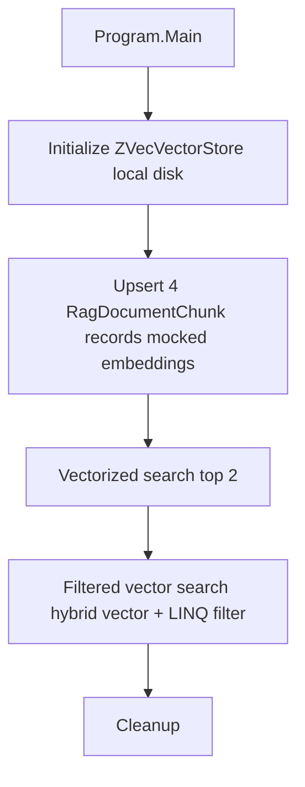

# ZVec.Rag.Console

A minimal local-first RAG (Retrieval-Augmented Generation) console sample built on
`ZVec.Extensions.VectorData` over the native embedded vector engine `ZVec.NET`.

## What it demonstrates

- **Local embedded vector store** — no external database server; data lives on disk
  in a temp directory.
- **Document chunk ingestion** — upserts four sample chunks with metadata (source).
- **Vectorized search** — runs a semantic search and prints ranked results with scores.
- **Hybrid filtered search** — combines vector search with a LINQ metadata filter
  (`x.Source == "rag-pipeline.md"`) translated through the ZVec filter expression visitor.

## Embeddings

Embeddings are mocked with a deterministic hash-based 4-dimensional vector so the
sample runs without an external embedding service. In a real RAG pipeline, replace
`MockEmbedding` with a call to `IEmbeddingGenerator<string, float>` from
`Microsoft.Extensions.AI`.

## Run

```bash
dotnet run --project samples/ZVec.Rag.Console/ZVec.Rag.Console.csproj
```

## Architecture



## Record schema

The `RagDocumentChunk` record is decorated with both ZVec native mapping attributes
(`ZVecId`, `ZVecField`, `ZVecVector`) and `Microsoft.Extensions.VectorData` attributes
(`VectorStoreKey`, `VectorStoreData`, `VectorStoreVector`) — the dual-attribute pattern
used across the ZVec.NET-RAG connector.
